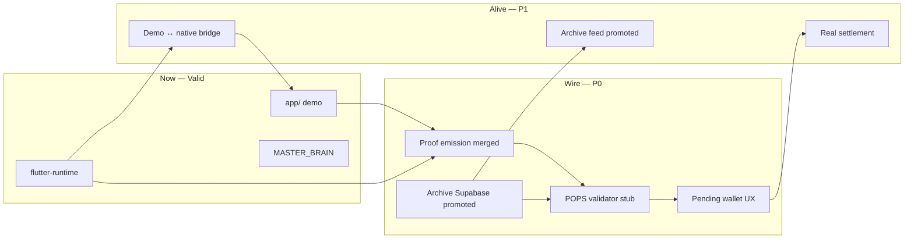

# Integration & Build Readiness Audit — [ i ]

**Audit date:** 2026-05-25  
**Phase:** 2 — Integration truth (post-archaeology)  
**Verdict:** **PARTIAL — partially alive, not production-ready**  
**Canonical workspace:** `~/Desktop/IVAULT/i-project-rescue/i_project_migration_archive`  
**Active branch:** `reliability/wire-proof-collector-live-loop` (19 commits ahead of `origin/main`)

---

## 1. Executive verdict

[ i ] is **real but fragmented**. The organism has a brain (MASTER_BRAIN), a face (investor demo `app/`), native senses (flutter-runtime), and a production body elsewhere (eye-earn-sparkle-archive). What is missing is the **circulatory system**: proof → POPS → pending wallet → settlement.

| Dimension | Status | One-line |
|-----------|--------|----------|
| **Product constitution** | ✅ Valid | `CANONICAL/i_SOURCE_OF_TRUTH.md` + owner ADRs |
| **Knowledge map** | ✅ Valid | ENTITIES / SYSTEMS / RELATIONSHIPS + 70 P0 chats |
| **Investor demo** | ✅ Runs | `app/` — 4-tab product + presenter mode; build clean |
| **Native ET core** | ✅ Valid | flutter-runtime — **211 tests pass**, Android smoke PASS |
| **Proof / POPS design** | ✅ Valid | Schema + six-layer architecture documented |
| **Proof → wallet loop** | 🟡 In progress | Emission exists locally; POP boundaries on feature branch; **no Supabase wire** |
| **Production web platform** | 🟡 External | Archive repo — **not promoted** into migration archive |
| **Elo / modules / iAM** | 🔵 Designed | Entity map exists; implementation deferred |
| **Chat recovery** | 🟡 67% | 70/104 P0 extracted; 189 Desktop portable copy |

**Bottom line:** Stop archaeology. Start **wiring and promotion** on a single spine.

---

## 2. What is built and valid (evidence-backed)

### Runnable today

| Asset | Path | Verification | Classification |
|-------|------|--------------|----------------|
| Investor MVP app | `app/` | `npm run typecheck` ✅ · `npm run build` ✅ | **Canonical demo** (ADR-014) |
| Flutter ET runtime | `integrations/eye-tracking/flutter-runtime/` | `flutter test` **211 passed** | **Canonical native core** |
| Web vision lab | `integrations/eye-tracking/vision-v2/` | `npm install && npm run build` ✅ | **Experimental lab** |
| Proof schema + Dart types | `docs/technical/PROOF_PACKET_SCHEMA_V0.md`, `lib/proof/` | Unit tests pass | **Canonical contract** |
| POP design | `POPS_MULTI_SIGNAL_VALIDATION_ARCHITECTURE.md` | Source-verified | **Canonical architecture** |
| System ownership | `docs/technical/SYSTEM_PROMOTION_SOURCE_OF_TRUTH.md` | 35 systems mapped | **Canonical promotion law** |
| Entity organism map | `MASTER_BRAIN/ENTITIES/`, `SYSTEMS/`, `RELATIONSHIPS/` | Owner ADRs locked | **Canonical knowledge** |
| HTML prototype archive | `02_clickable_prototypes/` … `07_currency_system/` | Static | **UX evidence** |
| Chat portable export | `~/Desktop/[i]_PROJECT_CHAT_EXTRACTION/` | 189 threads, 292 attachments | **Reference corpus** |

### GitHub org (complete clone set)

All **11** `iappmodel` repos cloned under `~/Desktop/i-project-rescue/github-source-repos/`.

| Repo | Role | Branch checked out | Notes |
|------|------|-------------------|-------|
| `i-project` | Integration archive | `main` @ stale clone | **Live work** in migration archive |
| `eye-earn-sparkle-archive` | Production web + Supabase | `codex/investor-demo-mode-v2` | Should reset to `main` for promotion |
| `eye-earn-sparkle` | v1 consumer shell | `demo-investor` | Wallet demo commits promoted |
| `eye_tracking_app` | Native ET upstream | `main` | Sync source for flutter-runtime |
| `i-initial-structures` | ELO / trust / studio types | `main` | Mirrored to `integrations/eye-tracking/source/` |
| `eye-earn-sparkle-v2` | Historical vision | `main` | Preserve only |
| `i-the-app`, `iview`, `56c8e614*` | Stubs | — | Archive / empty |

---

## 3. Built but not wired

| Gap | What exists | What’s missing |
|-----|-------------|----------------|
| **Proof → settlement** | `sealAndEmit()`, `ProofLiveLoopBridge`, POP JSON boundaries on feature branch | Supabase ingest, POPS validator service, ledger credit |
| **Loop 1 → real signals** | Flutter gaze pipeline | `app/` still mocks gates; no Capacitor/WebSocket bridge |
| **Wallet production** | Archive `supabase/migrations/*wallet*` | Not copied to `app/supabase/` |
| **Rewards engine** | Archive `issue-reward`, attention RPCs | Not connected to proof packet lifecycle |
| **Web vision in product** | Archive @ `22cabd3`, vision-v2 lab | Not in canonical `app/` shell |
| **ELO entity UI** | `integrations/eye-tracking/source/src/elo/` mock | Not in Loop 1 demo; entity ADR locked |
| **Studio** | 3 lineages (source types, archive AI UI, IVAULT monolith) | No merged web shell |
| **iVatar** | Preservation snapshot only | Zero canonical implementation |

### Feature branch in flight (merge candidate)

Branch `reliability/wire-proof-collector-live-loop` adds **POP accounting boundaries** + **proof live loop wiring** (19 commits). This is the correct direction for P0 — **merge to `main` after review**, not a parallel product fork.

---

## 4. Designed only (valid ideas, no production code)

| Domain | Evidence | MVP scope |
|--------|----------|-----------|
| **iAM** identity OS | Chat rank 100, `ENTITIES/iAM.md` | **Post-MVP** (owner ENT-05) |
| **i* module alphabet** | iGET, iGO, iHEAR chats + `SYSTEMS/ModuleAlphabet.md` | **Post-MVP** (MOD-01 TBD) |
| **26+ω full coin taxonomy** | `i-app-economy-rules.md` | **Deferred** (ADR-001 Tier 2) |
| **Remote control product** | Master brief + vision-v2 | Experimental |
| **Attention marketplace global** | Constitution build priority #10 | Future |

---

## 5. Owner decisions — resolved vs open

### ✅ Resolved (2026-05-25)

| ID | Decision |
|----|----------|
| ENT-01 | Elo entity = ELO UI mock (same product) |
| ENT-05 | Elo and iAM **separate** |
| CR-02–06 | Build Tier 1 **a/i/v/e/o** now; 26+ω later |
| HI-01 | Canonical pitch = `app/` linear + archive v2 reference |
| HI-02 | Product IA = **4-tab** Feed/Earn/Wallet/Profile |
| CR-01 | Session bypass fixed in demo paths |

### 🟡 Open

| ID | Topic |
|----|-------|
| MOD-01 | Roadmap module list on Profile/Roadmap screens |
| ENT-02 | POP user-facing brand name |
| ENT-04 | iVatar — cut, pitch-only, or build |
| MERGE-01 | Merge `reliability/wire-proof-collector-live-loop` → `main` |

---

## 6. Knowledge & chat integration status

| Corpus | Count | Status |
|--------|------:|--------|
| P0 chat extraction (MASTER_BRAIN) | **70 / 104** | Batches 01–07; **34 remain** |
| Desktop portable extraction | **189** threads | `~/Desktop/[i]_PROJECT_CHAT_EXTRACTION/` |
| Branch audits | **11+** | Complete — historical reference |
| Entity map | **22 files** | ENTITIES + SYSTEMS + RELATIONSHIPS |
| Owner ADRs | **3** | Entity, Currency, Demo IA |

**Chat work is no longer blocking MVP.** Remaining extraction informs post-MVP modules, not Loop 1.

---

## 7. IVAULT desktop (56 GB) — integration delta

Prior audit: [`IVAULT_FULL_AUDIT_2026-05-25.md`](IVAULT_FULL_AUDIT_2026-05-25.md)

| Action bucket | Status since May 25 |
|---------------|---------------------|
| P0 code promotions (DEMOS → rescue) | ✅ Done (sparkle, archive, iview, vision-v2) |
| P0 knowledge promotions | ✅ Done (economy rules, feature bible, prototypes) |
| P0 chat batches 41–70 | ✅ Done |
| P2 duplicate discard (~2.7 GB) | ⬜ After merge verification |
| Firebase key rotation | ⚠️ **Owner action** — adminsdk deleted, rotate in console |

---

## 8. The spine — what must happen for [ i ] to come alive

This is the **minimum viable organism**, in order. Do not parallelize randomly.

---

## 9. Build queue (ordered)

### P0 — Next 2 weeks (make the loop real)

| # | Task | Owner repo | Done when |
|---|------|------------|-----------|
| 1 | **Merge** `reliability/wire-proof-collector-live-loop` → `main` | migration archive | CI/tests green on main |
| 2 | **Promote** archive wallet ledger + `issue-reward` → `app/supabase/` | sparkle-archive | Migrations apply locally |
| 3 | **POPS validator stub** accepts `ProofPacketV0` | migration archive | Packet in → pending hold out |
| 4 | **Wire** pending wallet UX (v2 patterns → `app/`) | `app/` | Matches demoState lifecycle |
| 5 | **Device demo path**: flutter-runtime Seal Proof → log/API stub | flutter-runtime | End-to-end on Android device |

### P1 — Weeks 3–6 (production surface)

| # | Task |
|---|------|
| 6 | Promote Stripe + merchant checkout (atomic with ledger) |
| 7 | Cherry-pick web vision `22cabd3` when Capacitor shell decision made |
| 8 | Trust/safe-action Supabase tables from `integrations/eye-tracking/source/` |
| 9 | ELO mock → feed ranking experiment (entity ADR) |
| 10 | Finish P0 chat extraction 71–104 (background, non-blocking) |

### P2 — Weeks 7–12 (marketplace body)

| # | Task |
|---|------|
| 11 | Studio three-way merge (types + archive AI + routes) |
| 12 | Admin panel promotion from archive |
| 13 | Evidence vault SQL reconciled to proof v0 |
| 14 | MOD-01 owner lock → Roadmap screen modules |
| 15 | iVatar decision + snapshot or cut |

### P3 — Discard / hygiene

| # | Task | Reclaim |
|---|------|---------|
| 16 | Delete DEMOS duplicates (X1–X6) | ~2.7–12 GB |
| 17 | Refresh stale `github-source-repos/i-project` clone | Hygiene |
| 18 | Reset archive checkout to `main` | Hygiene |
| 19 | Promote `i_app_notion_md_package/` → MASTER_BRAIN | Knowledge |
| 20 | Cold-store raw CHATGPT export (keep index) | Disk |

---

## 10. 30 / 60 / 90 day “alive” definition

| Horizon | [ i ] is “alive” when… |
|---------|-------------------------|
| **30 days** | Android device completes Watch→Verify→Seal Proof→pending wallet record (even if manual admin approve) |
| **60 days** | `app/` or Capacitor shell shows **real pending settlement** from proof packet; archive Supabase runs locally |
| **90 days** | Creator can publish campaign → user earns → withdraw preview uses **real ledger** (test mode Stripe OK) |

---

## 11. What NOT to do

- ❌ Open new demo architectures (6+ already audited)
- ❌ Re-explain Elo/POP from chat — use `RELATIONSHIPS/UNIVERSE_MAP.md`
- ❌ Implement 26+ω coins before Tier 1 loop works
- ❌ Bulk-merge eye-earn-sparkle-archive or ET checkpoint branches
- ❌ Build iAM / full module alphabet before Loop 1 ships
- ❌ Another archaeology pass without a wiring milestone

---

## 12. Session start checklist

1. [`INTEGRATION_READINESS_AUDIT_2026-05-25.md`](INTEGRATION_READINESS_AUDIT_2026-05-25.md) — **this file**
2. [`RELATIONSHIPS/UNIVERSE_MAP.md`](RELATIONSHIPS/UNIVERSE_MAP.md) — organism
3. [`docs/technical/SYSTEM_PROMOTION_SOURCE_OF_TRUTH.md`](../docs/technical/SYSTEM_PROMOTION_SOURCE_OF_TRUTH.md) — where code lives
4. [`PROMOTION_AND_DISCARD_QUEUE.md`](PROMOTION_AND_DISCARD_QUEUE.md) — next actions
5. [`DEVELOPMENT_LOG.md`](DEVELOPMENT_LOG.md) — recent work

---

## 13. Audit confidence

| Area | Confidence |
|------|------------|
| Build/test verification | **High** — run 2026-05-25 |
| Repo/org completeness | **High** — all 11 cloned |
| Promotion map | **High** — SoT doc |
| Production wiring state | **High** — confirmed gaps |
| IVAULT disk reclaim estimates | **Medium** |
| 90-day timeline | **Medium** — depends on merge + promotion velocity |

---

*Phase 2 complete. Next engineering milestone: **merge proof-collector branch + promote Supabase financial core**.*

---

## 14. Post-P1 update (2026-05-26)

**Verdict revision:** Proof → wallet loop is **wired locally** (not production-deployed).

| Item | Status |
|------|--------|
| PR #1 merged to `main` | ✅ |
| POP validator + CORS | ✅ |
| Supabase `pop_pending_holds` + settle RPC | ✅ smoke PASS |
| App live wallet + Settle + auto-settle option | ✅ |
| `./scripts/dev_stack.sh` one-command local stack | ✅ |
| CI workflow (validator + app + smoke) | ✅ |
| Chat P0 extraction | **90/104** (batches 08–09) |
| Flutter device Seal Proof E2E | Runbook ready — **device tap pending** |

See [`WIRING_STATUS.md`](WIRING_STATUS.md) for current spine map.
