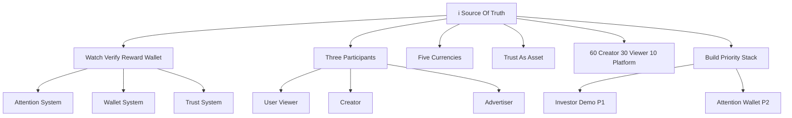
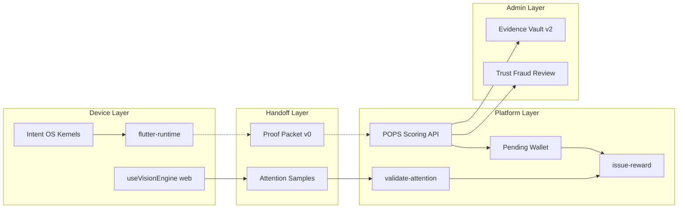
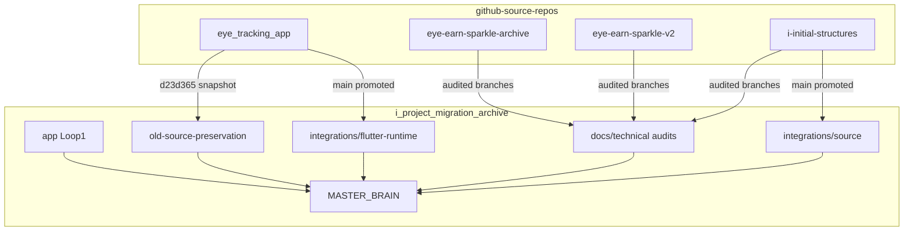
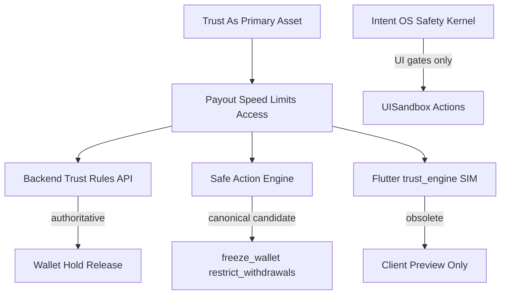

# KNOWLEDGE_GRAPH

**Generated:** 2026-05-21  
**Format:** Markdown + Mermaid — links concepts, evidence, and classification

---

## 1. Product Knowledge Graph (Constitution Layer)

---

## 2. Technical Pipeline Graph

**Gap node:** ProofPacket is represented as a schema target in the audits; packet emission and POPS ingestion are **not verified as wired** in this corpus.

---

## 3. Repository Evidence Graph

---

## 4. Concept → Evidence → Classification Matrix

| Concept | Primary evidence | Classification |
|---------|------------------|----------------|
| Core Loop | i_SOURCE_OF_TRUTH, app/ screens | Canonical intent / Partial impl |
| aCoins/iCoins/… | Constitution; Vicoin/Icoin in archive | Canonical / Naming conflict |
| POPS six layers | POPS_MULTI_SIGNAL doc; IVAULT API | Canonical design / Partial code |
| Proof Packet v0 | PROOF_PACKET_SCHEMA (referenced); proof_packet_v0.dart (referenced) | Candidate canonical schema / No verified emission |
| Pending wallet UX | demoState.ts | Experimental reference |
| Safe Action Engine | i-initial-structures source | Canonical candidate |
| Web vision unified | 22cabd3 branch audit | Canonical candidate |
| Native gaze runtime | flutter-runtime | Canonical |
| Studio (collab) | integrations/source | Canonical candidate types |
| Studio (publish monolith) | IVAULT snapshot | Experimental reference |
| i Command routing | IVAULT src/lib/i | Experimental |
| ELO / iVatar | elo/ mock; masterbrain pointer | Experimental / Unknown |
| Evidence Vault v2 | SQL 204–209 | Canonical admin layer |
| Investor Loop 1 | app/ | Canonical candidate UX |
| Full-app investor demo | archive v2 branch | Experimental complement |
| Cursor v1 branches | CURSOR audits | Obsolete |
| Client economy sim | IVAULT lib/reward_engine | Obsolete for production |

---

## 5. Screen Flow Graph (Investor Paths)

```mermaid
flowchart TD
  subgraph loop1 [app Loop 1 Canonical Candidate]
    L1S[Splash] --> L1F[Feed]
    L1F --> L1O[Offer Detail]
    L1O --> L1C[Consent Gate]
    L1C --> L1W[Watch Verify]
    L1W --> L1V[Verification Result]
    L1V --> L1R[Reward Reveal]
    L1R --> L1Wal[Wallet]
    L1Wal --> L1Conv[Convert]
    L1Conv --> L1With[Withdraw Preview]
    L1With --> L1Cre[Creator Economics]
    L1Cre --> L1Proof[Proof Layer]
    L1Proof --> L1Road[Roadmap]
  end

  subgraph v2demo [Archive Demo v2 Experimental]
    H[Hero Entry] --> SC[Scenario Selector]
    SC --> Feed[Immersive Feed]
    Feed --> Pend[Pending Earn]
    Pend --> WalSeg[Wallet Segments]
    WalSeg --> Checkout[Checkout Timeline]
  end
```

---

## 6. Trust & Authority Graph

---

## 7. Cross-Links to MASTER_BRAIN Files

| Graph node | Detail file |
|------------|-------------|
| Core Loop | CANONICAL/CORE_LOOP.md |
| Currencies | ECONOMY/CURRENCY_ECOSYSTEM.md |
| Wallet | ECONOMY/WALLET_SYSTEM.md |
| POPS / Proof | TRUST_SYSTEM/POPS_AND_PROOF.md |
| Trust | TRUST_SYSTEM/TRUST_AND_GOVERNANCE.md |
| Attention | ATTENTION_SYSTEM/VERIFICATION_AND_VISION.md |
| Creator | CREATOR_ECONOMY/STUDIO_AND_CAMPAIGNS.md |
| Investor demo | INVESTOR_DEMO/DEMO_PATHS_AND_FLOWS.md |
| Architecture | TECH_ARCHITECTURE/MULTI_REPO_AND_AUTHORITY.md |
| Decisions | DECISIONS/ARCHITECTURE_DECISIONS.md |
| Conflicts | DUPLICATES_AND_CONFLICTS.md |

---

## 8. Open Edges (Unknown)

- ProofPacket → POPS (wire format reconciliation incomplete)
- SafeAction → live wallet state (not connected in i-initial-structures)
- iVatar concept → any implementation (none found)
- Full 35-system SoT → source doc referenced but not readable during quality review

See `RESEARCH/GAPS_AND_UNKNOWNS.md`.
