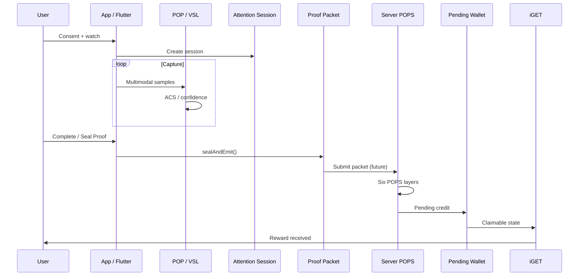

# Relationship: Attention → Proof → Reward

**Classification:** Candidate — technical spine  
**Confidence:** High (design) · Medium (wiring)

---

## End-to-end pipeline

---

## Stage ownership

| Stage | Owner system | MVP status |
|-------|--------------|------------|
| Consent gate | App | ✅ |
| Session create | attentionSession.ts | ✅ CR-01 |
| Signal capture | POP + Eye Tracking | Partial (Flutter) |
| Stability | VSL | ✅ v1 |
| Seal | Proof Packet v0 | ✅ local + validator |
| Server validate | POPS / validate-attention | ✅ validator stub |
| Pending credit | Supabase wallet | ✅ pop_pending_holds |
| Claim UX | iGET (concept) / Wallet screens | ✅ Settle button + live sync |

---

## CR-01 — session bypass (resolved in demo)

**Rule:** No `attentionSessionId` → no reward collection.

Fixed: `app/demoContext.tsx`, sparkle-archive Index.tsx.

**Production:** Must hold when POPS wired.

---

## ACS model (conv 039)

Attention Confidence Score = f(presence, engagement quality, penalties)

Feeds POPS layers — not a separate parallel system.

---

## Five-gate UX vs six POP layers

| UX gate (demo) | POP layer (backend) |
|----------------|---------------------|
| Consent | Session integrity |
| Presence | Proof of presence |
| Dwell | Perception + participation |
| Interaction | Participation |
| Result | Reward eligibility |

Mapping is **narrative simplification** for investors — not 1:1 code.

---

## Evidence paths

| Document | Role |
|----------|------|
| `SYSTEMS/AttentionVerification.md` | Session + gates |
| `SYSTEMS/ProofAndSeal.md` | Packet + seal |
| `TRUST_SYSTEM/POPS_AND_PROOF.md` | Six layers |
| `RELATIONSHIPS/POP_Wallet.md` | Settlement |
| conv 039 | ACS + schema |
| conv 108 | Presence Layer |

---

## Next wire (promotion queue)

1. Proof Packet emission on device (Flutter) — done locally  
2. Ingest packet in POPS  
3. Pending wallet RPC on validation  
4. iGET claim UI on production wallet  

See `PROMOTION_AND_DISCARD_QUEUE.md`
