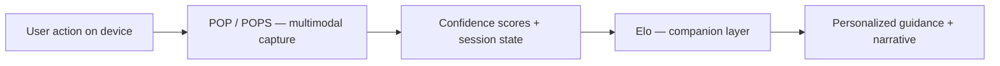

# Relationship: Elo ↔ POP

**Classification:** Candidate — **strongest cross-chat consensus**  
**Confidence:** High (philosophical) · Medium (implementation boundary)

---

## Canonical sentence (owner-stated)

> **POP is the senses of Elo.**

Elo **experiences** the world through POP. POP does not **be** Elo.

---

## Direction of data

---

## Division of responsibility

| | Elo | POP |
|---|-----|-----|
| **Layer** | Entity / companion | Sensing / validation |
| **User sees** | Voice, guidance, continuity (candidate) | Usually invisible infrastructure |
| **Decides rewards** | No | Eligibility input only — server decides |
| **Stores memory** | User context, preferences (candidate) | Session signals, proof artifacts |
| **Failure mode** | Bad advice, over-personalization | False positive/negative qualification |

---

## What POP feeds Elo (candidate)

- Session qualified / not qualified
- Attention confidence band (not raw gaze video)
- Campaign completion status
- Trust-relevant patterns (aggregated, not surveillance dump)

---

## What Elo must NOT do

- Bypass POP session gates for rewards
- Claim certainty about user's inner attention
- Replace POPS server authority

---

## Implementation today

| Component | Elo | POP |
|-----------|-----|-----|
| Code | `app/` presence layer + panel + profile teaser | POPS docs + flutter VSL + `VisionContext` |
| Wired together | **Partial** — vision landmarks, proof-events status, watch-verify attention → expression engine | Session/proof gates unchanged |

**Loop 1 (2026-05-30):** `EloPresenceLayer` on immersive + watch-verify; procedural SVG membrane; voice evoke; personality stack in local config.

---

## Evidence

- User ChatGPT cross-chat thread (May 2026)
- `ENTITIES/ELO.md`, `ENTITIES/POP.md`
- Rank 108 Presence Layer — POP as superset of eye tracking
- Rank 143 ELO companion — separate product layer

**Owner confirm:** ENT-01, ENT-02
