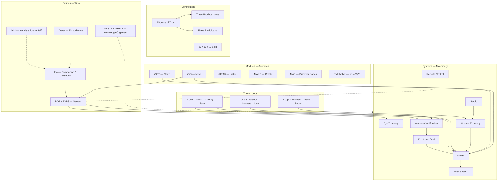

# [ i ] Universe Map

**Generated:** 2026-05-25  
**Classification:** Candidate synthesis — owner review required  
**Sources:** 189 Desktop chats + P0 batches 01–07 + constitution + audits

---

## Organism diagram

---

## Layer model (stack)

| Layer | Members | Analogy |
|-------|---------|---------|
| **L0 Constitution** | SoT, revenue model, build priority | DNA |
| **L1 Entities** | Elo, POP, iAM, iVatar | Organs with identity |
| **L2 Systems** | Wallet, Eye Tracking, Studio, Verification… | Organs that work |
| **L3 Modules** | iGET, iGO, iHEAR… | Limbs / surfaces |
| **L4 Loops** | Watch/Verify/Earn, Browse/Save/Return, Balance/Convert/Use | Circulatory patterns |
| **L5 Knowledge** | MASTER_BRAIN, Desktop extraction, chat recovery | Memory |

---

## Three product loops (rank 9 — product brief)

| Loop | Flow | Primary systems |
|------|------|-----------------|
| **1** | Watch → Verify → Earn | POP, Eye Tracking, Attention Verification, Proof, Wallet, iGET |
| **2** | Browse → Save → Return | Feed, Creator Economy, iHEAR/iMAP (future) |
| **3** | Balance → Convert → Use | Wallet, iPAY/iBUY, Trust, conversion |

---

## Three participants

| Participant | Provides | Receives |
|-------------|----------|----------|
| **User** | Attention | aCoins, iCoins, trust |
| **Creator** | Content + audience | Revenue share, tips |
| **Advertiser** | Campaign budget | Verified attention |

---

## Entity relationship table

| From | To | Relationship | Doc |
|------|-----|--------------|-----|
| Elo | POP | POP = senses of Elo | [Elo_POP.md](./Elo_POP.md) |
| POP | Wallet | Validated sessions → pending → available | [POP_Wallet.md](./POP_Wallet.md) |
| Elo | Studio | Assistant for create/publish | [Elo_Studio.md](./Elo_Studio.md) |
| Elo | iAM | Overlap on memory/identity — **unresolved** | ENT-05 |
| POP | Eye Tracking | Gaze is one POP channel | [EyeTracking.md](../SYSTEMS/EyeTracking.md) |
| Proof | POP | Packet encodes POP layer scores | [Attention_Proof_Reward.md](./Attention_Proof_Reward.md) |
| iGET | iEARN | Earn qualifies; GET claims | [Modules_Currency.md](./Modules_Currency.md) |
| iGO | POP | Geofence + presence for movement proof | [ModuleAlphabet.md](../SYSTEMS/ModuleAlphabet.md) |

---

## MVP vs post-MVP (constitution build order)

| In MVP spine | Deferred |
|--------------|----------|
| Loop 1 demo (`app/`) | Full i* module alphabet |
| Wallet (pending-first) | iAM identity OS |
| Trust (simulated → wire) | 26+ω full coin taxonomy |
| Flutter ET runtime | iVatar embodiment |
| POP design + partial impl | Elo companion (beyond mock?) |
| Creator economics narrative | Studio full pipeline merge |

---

## Cross-platform evidence index

| Platform | Count | Location |
|----------|-------|----------|
| Desktop raw | 189 threads | `~/Desktop/[i]_PROJECT_CHAT_EXTRACTION/` |
| MASTER_BRAIN structured | 70 P0 | `CHAT_RECOVERY/EXTRACTED/conversations/` |
| Repo code | audits + integrations | `docs/technical/*`, `app/`, `integrations/` |
| ChatGPT attachments | 292 files | Desktop `chatGPT/attachments/` |

---

## Open owner decisions

| ID | Topic | Status |
|----|-------|--------|
| ENT-02 | POP user-facing branding | Open |
| ENT-04 | iVatar scope | Open |
| MOD-01 | Roadmap module list | **Deferred** |

**Resolved 2026-05-25:** ENT-01, ENT-05, CR-02–06, HI-01, HI-02 — see `DECISIONS/`
