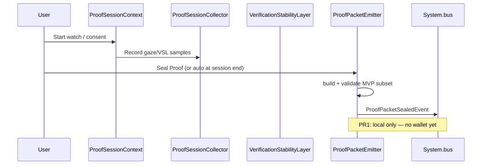

# Seal Proof

**Classification:** Canonical candidate (implementation in flutter-runtime)  
**Related:** Proof Packet v0, POPS, attention sessions, CR-01

---

## What it is

**Seal Proof** is the action of **finalizing a Proof Packet v0** at the end of a verified attention session — turning collected signals into a sealed, immutable evidence artifact.

It is not a separate product feature from proof packets. It is the **verb** for closing a session:

```
Collect signals → Build packet → Seal → Emit event → (future) wallet settlement
```

In the Flutter runtime debug UI, the button label **"Seal Proof"** triggers this path manually for device testing.

---

## Implementation (evidence)

| Layer | Location |
|-------|----------|
| Emitter | `integrations/eye-tracking/flutter-runtime/lib/proof/proof_packet_emitter.dart` |
| Debug tap | `integrations/eye-tracking/flutter-runtime/lib/main.dart` → `_sealProofPacketDebug()` |
| Tests | `integrations/eye-tracking/flutter-runtime/test/seal_proof_tap_test.dart` |
| Schema | `docs/technical/PROOF_PACKET_SCHEMA_V0.md` |

**Invariant (CR-01 aligned):** `sealAndEmit()` throws if there is **no active session**:

```text
Cannot seal proof packet without an active session
```

---

## Flow



---

## vs "Proof Layer" (Loop 1 app)

| Surface | Role |
|---------|------|
| `app/` ProofLayerScreen | **Narrative** — explains mocked gaze + flutter-runtime promotion status |
| Flutter Seal Proof | **Technical** — actually builds/seals Proof Packet v0 types |
| POPS backend | **Production** — validate-attention → issue-attention-reward |

---

## Status

| Item | State |
|------|--------|
| Packet schema v0 | Canonical |
| Local seal + bus event | Implemented (flutter-runtime) |
| Wallet settlement on seal | **Not wired** (pop-core PR sequence) |
| Web/React demo seal | **Not implemented** — mocked in `app/` |

---

## Chat / design notes

From P0 extraction (conv 039): production path must be **session-gated** — no reward without validated `attentionSessionId`. Seal Proof is the device-side mirror of that gate at proof emission time.
