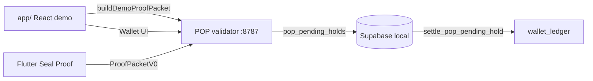

# [ i ] Wiring Status

**Updated:** 2026-05-26  
**Workspace:** `i_project_migration_archive`

One-page truth for what's wired vs mocked.

---

## Spine (Loop 1 → Wallet)

| Step | Status | Path |
|------|--------|------|
| Loop 1 UX (mock gaze) | ✅ | `app/src/screens/*` |
| CR-01 session gate | ✅ | `app/src/state/attentionSession.ts` |
| Proof packet submit (web) | ✅ | `app/src/lib/demoProofPacket.ts` |
| Seal Proof (Flutter) | ✅ local | `flutter-runtime/lib/proof/proof_packet_emitter.dart` |
| Validator HTTP | ✅ | `integrations/pop-core/validator/` |
| Pending holds | ✅ | `app/supabase/migrations/20260525220000_pop_pending_holds.sql` |
| Ledger settle | ✅ | `settle_pop_pending_hold` → `ledger_append` |
| App live wallet sync | ✅ | `app/src/state/useLiveWalletSync.ts` |
| Auto-settle (optional) | ✅ | `VITE_AUTO_SETTLE=true` |
| CORS (browser → validator) | ✅ | `validator/src/cors.ts` |

---

## Smokes (automated)

| Script | What |
|--------|------|
| `./scripts/smoke_pop_wallet_loop.sh` | local-json validate → settle |
| `./scripts/smoke_pop_wallet_loop_supabase.sh` | full Supabase ledger |
| `./scripts/smoke_full_loop.sh` | unified entry |
| `./scripts/run_all_tests.sh` | validator + app + flutter |
| `./scripts/dev_stack.sh` | start everything |

---

## Still mocked / open

| Item | Notes |
|------|-------|
| React gaze signals | Mocked — Flutter has real pipeline |
| Capacitor / WS bridge | Not built — React ↔ Flutter separate |
| Android device E2E | Runbook ready — needs device tap |
| Supabase Auth in app | Demo UUID only |
| Elo UI in Loop 1 | Entity ADR locked — UI deferred |
| Production Stripe | Post-MVP |

---

## Knowledge map

| Question | Read |
|----------|------|
| What is Seal Proof? | `TRUST_SYSTEM/SEAL_PROOF.md` |
| Elo vs POP | `ENTITIES/ELO.md`, `RELATIONSHIPS/Elo_POP.md` |
| Full organism | `RELATIONSHIPS/UNIVERSE_MAP.md` |
| Local dev | `docs/RUNBOOK_LOCAL.md` |
