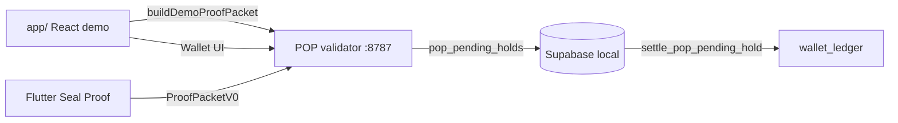

# [ i ] Wiring Status

**Updated:** 2026-05-30  
**Workspace:** `i_project_migration_archive`

One-page truth for what's wired vs mocked.

---

## Spine (Loop 1 → Wallet)

| Step | Status | Path |
|------|--------|------|
| Loop 1 UX (mock gaze) | ✅ | `app/src/screens/*` |
| CR-01 session gate | ✅ | `app/src/state/attentionSession.ts` |
| Session attention samples | ✅ | `attentionSession.recordAttentionSample` → real `acsScore` |
| Proof packet submit (web) | ✅ | `app/src/lib/demoProofPacket.ts` (session-derived) |
| POP zone safety gates | ✅ | `PopActionExecutor` → Governance → Safety |
| Flutter gaze zones | ✅ | `resolveZoneFromGaze` + calibration bounds |
| Seal Proof (Flutter) | ✅ device | `flutter-runtime` + USB reverse E2E verified |
| Validator HTTP | ✅ | `integrations/pop-core/validator/` |
| Pending holds | ✅ | `app/supabase/migrations/20260525220000_pop_pending_holds.sql` |
| POP sessions schema | ✅ | `app/supabase/migrations/20260529120000_pops_sessions.sql` |
| Ledger settle | ✅ | `settle_pop_pending_hold` → `ledger_append` |
| App live wallet sync | ✅ | `app/src/state/useLiveWalletSync.ts` |
| Auto-settle (optional) | ✅ | `VITE_AUTO_SETTLE=true` |
| CORS (browser → validator) | ✅ | `validator/src/cors.ts` |

---

## Smokes (automated)

| Script | What |
|--------|------|
| `./scripts/smoke_pop_wallet_loop.sh` | local-json validate → settle |
| `./scripts/smoke_pop_wallet_loop_supabase.sh` | full Supabase ledger |
| `./scripts/smoke_full_loop.sh` | unified entry |
| `./scripts/run_all_tests.sh` | validator + app + flutter |
| `./scripts/smoke_auth_demo.sh` | Supabase demo user sign-in |
| `./scripts/smoke_proof_events.sh` | SSE proof-sealed on validate |
| `./scripts/smoke_flutter_seal_prep.sh` | Flutter deep link + bridge tests |
| `./scripts/smoke_capacitor_prep.sh` | Capacitor deps + web build |
| `./scripts/setup_capacitor_shell.sh` | Cap sync / `--add` native |
| `./scripts/smoke_android_env.sh` | Flutter + adb toolchain check |
| `./scripts/run_android_device_test.sh` | One-shot USB deploy + logcat |
| `./scripts/smoke_android_seal_postcheck.sh` | Verify pending hold after Seal Proof |
| `./scripts/open_wallet_on_device.sh` | Open wallet deep link on Android device |
| `./scripts/android_device_urls.sh` | Resolve POP/WALLET URLs for device mode |
| `./scripts/smoke_production_readiness.sh` | Pre-deploy builds + spine + templates |
| `./scripts/smoke_stripe_webhook_signed.sh` | Signed Stripe webhook local E2E smoke |
| `./scripts/smoke_vision_prep.sh` | Feature-flagged web vision prep checks |
| `./scripts/smoke_capacitor_native_prep.sh` | Native shell sync + manifest checks |
| `./scripts/smoke_validator_docker.sh` | Validator container build + health |
| `./scripts/build_production_artifacts.sh` | Build artifact tarball + deploy docs |
| `./scripts/smoke_organism_spine.sh` | Full spine (local + optional Supabase) |
| `./scripts/smoke_elo_presence.sh` | ELO presence module files + app build |
| `./scripts/smoke_pop_finish.sh` | POP finish keystone files + Flutter regression tests |
| `./scripts/smoke_investor_explainers.sh` | Investor explainer HTML series (9 files) |
| `./scripts/smoke_vision_proof_bridge.sh` | Vision → proof packet hints (Phase 34) |
| `./scripts/smoke_immersive_shell.sh` | Glass wallet/profile, out-profile, loop1 watch path (Phases 35–38) |
| `./scripts/enable_stripe_live_env.sh` | Stripe checkout env when keys in stack |

---

| `./scripts/dev_stack.sh` | start everything |

**Phase index:** `MASTER_BRAIN/PHASE_QUEUE_INDEX.md`

---

## Phase 2 (2026-05-26)

| Item | Status |
|------|--------|
| P0 chat extraction | **104/104** complete |
| Supabase Auth in app | ✅ Auto demo sign-in |
| Elo Profile teaser | ✅ Companion card |
| ELO presence membrane | ✅ Procedural SVG contours + POP mirror; voice evoke → session panel |
| ELO personality stack / rooms | ✅ Local config + onboarding + panel |
| React↔Flutter bridge | Design only — Phase 3 |
| Stripe checkout | Prep doc — owner keys needed |

---

## Phase 3 (2026-05-26)

| Item | Status |
|------|--------|
| Proof-events SSE relay | ✅ `GET /v1/proof-events/stream` |
| React `useProofEvents` | ✅ Profile Elo live status |
| Stripe function promotion script | ✅ `promote_stripe_functions.sh` |
| Stripe deploy / webhook smoke | ⏸ Owner keys required |
| Capacitor in-process bridge | Deferred Phase 4 |
| Android device E2E | Deferred — runbook only |

---

## Phase 4 (2026-05-26)

| Item | Status |
|------|--------|
| Deep link `?proofSession=` | ✅ Opens wallet tab |
| Wallet proof flash | ✅ Flutter seal → banner + auto-nav |
| SSE `localUserRef` filter | ✅ Stream query param |
| Stripe readiness UX | ✅ Withdraw banner + `stripeConfig.ts` |
| Stripe local deploy script | ✅ Skips without keys |
| Capacitor in-process bridge | Deferred Phase 5 |
| Android device E2E | Deferred — runbook only |

---

## Phase 5 (2026-05-26)

| Item | Status |
|------|--------|
| Flutter `WALLET_APP_URL` deep link | ✅ Logs after validate |
| Earn / Watch bridge UX | ✅ Live proof-events status |
| `stripeCheckout.ts` client | ✅ Ready when `VITE_STRIPE_CHECKOUT_URL` set |
| Capacitor shell | Prep doc only — `CAPACITOR_SHELL_PREP.md` |
| Android device E2E | Deferred — runbook + prep smoke |
| Stripe live deploy | Owner keys required |

---

## Phase 6 (2026-05-26)

| Item | Status |
|------|--------|
| Capacitor packages | ✅ `@capacitor/*` in `app/` |
| `capacitor.config.ts` | ✅ |
| Setup script | ✅ `setup_capacitor_shell.sh --add` |
| Native platform dirs | On demand (gitignored) |
| Android device E2E | Deferred — runbook |
| Stripe live deploy | Owner keys — `.env.local.stack.example` |

---

## Phase 7 (2026-05-26)

| Item | Status |
|------|--------|
| `EloCompanionCard` | ✅ Last seal + wallet jump |
| Android env smoke | ✅ `smoke_android_env.sh` |
| Android dev orchestration | ✅ `run_android_dev_loop.sh` |
| Phase queue index | ✅ `PHASE_QUEUE_INDEX.md` |
| Stripe Pro checkout UI | ✅ When `VITE_STRIPE_CHECKOUT_URL` live |
| Device Seal Proof tap | Manual — runbook + smokes |

---

## Still mocked / open

| Item | Notes |
|------|-------|
| React gaze signals | `VisionProvider` + `TargetOverlay`; Profile `VisionControlPanel` unifies calibration/settings/presets/editor behind `VITE_VISION_ENGINE`; full blink-remote panel still deferred |
| Vision bundle chunking | `vite.config.ts` manualChunks split (`mediapipe`, `supabase`, `react-vendor`, `vendor`) to avoid >500 kB main chunk |
| Capacitor native build | `setup_capacitor_shell.sh --add` |
| Production Stripe | `STRIPE_PHASE2.md` — keys deferred |
| Full Elo companion UI | Profile teaser only (ADR-013) |

---

## Phase 8 (2026-05-26)

| Item | Status |
|------|--------|
| `ORGANISM_STATUS.md` | ✅ One-page synthesis |
| `smoke_organism_spine.sh` | ✅ Local + optional Supabase |
| Stripe live env | ✅ `enable_stripe_live_env.sh` |
| Wallet Elo card | ✅ Live wallet tab |
| Device Seal Proof tap | Manual |

---

## Phase 9 (2026-05-27)

| Item | Status |
|------|--------|
| Android Seal Proof E2E | ✅ Samsung SM A146U, USB adb reverse |
| `android_device_urls.sh` | ✅ emulator / USB / LAN resolver |
| `run_android_device_test.sh` | ✅ one-shot deploy |
| `smoke_android_seal_postcheck.sh` | ✅ pending hold verify |
| Vite LAN host | ✅ `host: true` for WiFi fallback |
| Runbook | ✅ USB reverse primary path |

---

## Phase 10 (2026-05-27)

| Item | Status |
|------|--------|
| Production deploy runbook | ✅ `PRODUCTION_DEPLOY_RUNBOOK.md` |
| Pre-deploy smoke | ✅ `smoke_production_readiness.sh` |
| Device wallet deep link | ✅ `open_wallet_on_device.sh` |
| CI consolidation | ✅ production readiness job |

---

## Phase 11 (2026-05-27)

| Item | Status |
|------|--------|
| Coin label formatting | ✅ `Icoin` UI naming via shared formatter |
| Wallet / earn / reward text | ✅ normalized user-facing copy |

---

## Phase 12 (2026-05-27)

| Item | Status |
|------|--------|
| Signed Stripe webhook smoke | ✅ `smoke_stripe_webhook_signed.sh` |
| Webhook smoke integration | ✅ `smoke_stripe_webhook.sh` now executes signed smoke |
| Edge runtime import stability | ✅ local worker boot fixed (`@supabase/supabase-js@2`) |

---

## Phase 13 (2026-05-27)

| Item | Status |
|------|--------|
| Capacitor setup hardening | ✅ iOS add skips when Xcode unavailable |
| Native prep smoke | ✅ `smoke_capacitor_native_prep.sh` |

---

## Phase 14 (2026-05-27)

| Item | Status |
|------|--------|
| Web vision feature flag | ✅ `VITE_VISION_ENGINE` scaffold |
| Vision prep smoke | ✅ `smoke_vision_prep.sh` |
| Integration map update | ✅ safe-flag policy documented |

---

## Phase 15 (2026-05-27)

| Item | Status |
|------|--------|
| Loop 2 save/return scaffold | ✅ `saved` screen + localStorage model |
| Feed save action | ✅ teaser card can save + open saved flow |

---

## Phase 16 (2026-05-27)

| Item | Status |
|------|--------|
| Validator container packaging | ✅ Dockerfile |
| Validator container smoke | ✅ `smoke_validator_docker.sh` |

---

## Phase 17 (2026-05-27)

| Item | Status |
|------|--------|
| Production artifact builder | ✅ `build_production_artifacts.sh` |
| CI artifact upload | ✅ workflow uploads `.artifacts/*` |
| Test runner expansion | ✅ vision + artifact checks in `run_all_tests.sh` |

---

## Phase 18 (2026-05-27)

| Item | Status |
|------|--------|
| Audited vision subset vendored | ✅ `app/src/vision-unified/*` from `22cabd3` |
| Cherry-pick automation | ✅ `scripts/cherry_pick_vision_unified_22cabd3.sh` |
| Compile guardrail | ✅ `tsconfig.app.json` excludes `vision-unified/**` |

---

## Phase 19 (2026-05-27)

| Item | Status |
|------|--------|
| Vision calibration core adapter | ✅ `app/src/lib/visionCalibration/profile.ts` |
| Residual model normalizer | ✅ `app/src/lib/visionCalibration/residualModel.ts` |
| Runtime banner wiring | ✅ Earn screen shows runtime details when flag on |

---

## Phase 20 (2026-05-27)

| Item | Status |
|------|--------|
| TS/Vite alias bridge | ✅ `@/*` path support added |
| MediaPipe deps in app | ✅ `@mediapipe/face_mesh` + `@mediapipe/tasks-vision` |
| Shared vision stubs | ✅ `lib/logger.ts`, `lib/skinToneFallback.ts` |
| Vision smoke hardening | ✅ asserts bridge prerequisites |

---

## POP finish plan (2026-05-30, PR #2)

| Item | Status |
|------|--------|
| Dead/duplicate Flutter cleanup | ✅ Stage 1 manifest |
| Unified zone commit path | ✅ `PopActionExecutor` |
| Calibrated gaze + stale frames | ✅ `gaze_coordinate_space`, `signal_stale_policy` |
| Y-plane transport + release landmarks | ✅ `runtime_transport_config`, `VisionProcessor.kt` |
| Session evidence → proof packet | ✅ `demoContext`, `demoProofPacket` |
| POP feature flags + kill switch | ✅ `popFeatureFlags.ts` |
| Flutter POP tests | ✅ `pop_finish_plan_test`, `pop_action_executor_test` |
| CI Supabase smoke gate | ✅ requires `supabase` CLI + Docker |

---

## Phases 34–40 (2026-05-28)

| Item | Status |
|------|--------|
| Vision → proof bridge (hints only) | ✅ `visionProofBridge.ts` + `demoProofPacket` + ADR |
| Vision source badge (Earn/Watch) | ✅ `VisionSourceBadge` |
| Immersive wallet/profile glass sheets | ✅ `ImmersiveGlassSheet`, wired on `ImmersiveFeedScreen` |
| Blink Remote lite (debug gaze) | ✅ `VisionBlinkRemoteLite` in `VisionControlPanel` |
| OUT-PROFILE engine v1 | ✅ `outProfileEngine.ts` + tap → consent/watch |
| Loop 1 immersive watch path | ✅ `beginImmersiveWatch` → consent gate → watch-verify |
| Consent gate vision copy | ✅ when `VITE_VISION_ENGINE=1` |
| Canon doc sync | ✅ FEATURE_BIBLE, ORGANISM_STATUS, this file |
| Production cutover checklist | ✅ `docs/technical/PRODUCTION_CUTOVER_CHECKLIST.md` (owner-gated) |

---

## Knowledge map

| Question | Read |
|----------|------|
| Organism overview | `ORGANISM_STATUS.md` |
| What is Seal Proof? | `TRUST_SYSTEM/SEAL_PROOF.md` |
| Elo vs POP | `ENTITIES/ELO.md`, `RELATIONSHIPS/Elo_POP.md` |
| Full organism | `RELATIONSHIPS/UNIVERSE_MAP.md` |
| Local dev | `docs/RUNBOOK_LOCAL.md` |
