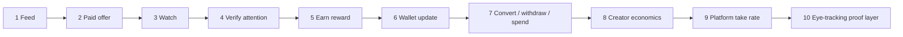

# [ i ] Canonical MVP Flow — Investor Demo Decision Map

**Status:** Decision map only — no redesign, no new features.  
**Scope:** Files already present in `i_project_migration_archive`.  
**Primary demo spine:** Loop 1 (*Watch → Verify → Earn*) from `06_feed_earning_loops/iapp_three_loops.html`, wired end-to-end in `integrations/eye-tracking/demos/investor-demo/`.

**Validation note:** Rewards may be shown as **pending validation** after the watch session before final settlement (provisional earn → review → approved/rejected). Eye-tracking is one proof signal among many; see [`docs/technical/POPS_MULTI_SIGNAL_VALIDATION_ARCHITECTURE.md`](technical/POPS_MULTI_SIGNAL_VALIDATION_ARCHITECTURE.md).

---

## How to run the demo today

| Entry | Path | Notes |
|-------|------|-------|
| Archive launcher | `prototype-app/index.html` | Sections `06_feed_earning_loops`, `04_wallet_payments`, `05_creator_campaigns`, `07_currency_system`, `09_eye_tracking` |
| Canonical HTML loop | `06_feed_earning_loops/iapp_loop1_watch_verify_earn.html` | 8 clickable steps; static mocked gaze |
| Runnable React demo | `integrations/eye-tracking/demos/investor-demo/` | `npm install && npm run dev` — mocked gaze, presenter Prev/Next |
| Clickable MVP nav | `integrations/eye-tracking/prototypes/i-mvp-prototype/src/App.tsx` | Same page sequence; `eye-tracking: simulated` badge |

**Canonical screen order (investor demo):**  
`splash → feed → offer-detail → watch-verify → verification-result → reward-reveal → wallet → convert → withdraw-preview → creator-economics → roadmap`  
(`integrations/eye-tracking/demos/investor-demo/src/demo/screensOrder.ts`)

---

## Flow at a glance

---

## Step-by-step decision map

### Step 1 — User opens feed

| Field | Detail |
|-------|--------|
| **User action** | Launch app; land on content feed; optionally tap wallet chip or filter pills (For you / Earn). |
| **Screen / file** | `06_feed_earning_loops/iapp_feed_screen.html`, `06_feed_earning_loops/iapp_immersive_feed.html`, `02_clickable_prototypes/index4.html` (hub), `integrations/eye-tracking/demos/investor-demo/src/screens/FeedScreen.tsx`, `integrations/eye-tracking/demos/investor-demo/src/screens/SplashScreen.tsx` |
| **Data needed** | Feed cards (organic + sponsored), stories row, filter pills, wallet balance chip (`iCoins`), platform badges (YT/TK/IG), sponsored “Watch & Earn” badge + reward amount. |
| **Button / navigation** | Splash → tap to continue → Feed; bottom/tab navigation implied in masterplan (`01_strategy_docs/i-app-masterplan.md` Part 1.2); wallet chip → Wallet; sponsored card → Offer (Step 2). |
| **Current repo evidence** | Feed UI exists in HTML and React; `FeedScreen.tsx` shows stories, filters, organic card, sponsored Nike card with earn badge; `i-app-masterplan.md` defines Presenter Step 2 (Content Feed). |
| **Missing implementation** | No single unified app shell; HTML feed screens are not linked to wallet/watch flows; tab bar not wired across all rescued HTML files; no live backend feed API. |
| **MVP priority** | **Required** |

---

### Step 2 — User selects paid / verified content

| Field | Detail |
|-------|--------|
| **User action** | Tap sponsored / verified offer; review reward, watch duration, verification requirements, and revenue split preview. |
| **Screen / file** | `06_feed_earning_loops/iapp_loop1_watch_verify_earn.html` (Steps 1–2: Earn marketplace + Offer detail), `integrations/eye-tracking/demos/investor-demo/src/screens/OfferDetailScreen.tsx`, `integrations/eye-tracking/demos/investor-demo/src/demo/mockData.ts` (`DEFAULT_SPONSORED_OFFER`) |
| **Data needed** | Offer id, brand, platform, watch duration (e.g. 4:30), reward in iCoins (e.g. +2.00), requirements (full watch, eye-tracking, attention ≥ 70), split preview (You earn / Creator 60% / Platform 10%). |
| **Button / navigation** | Feed sponsored card → `selectOffer()` → Offer detail; Back → Feed; **Start watching** → Watch (Step 3). Alternate entry: Loop 1 HTML Step 1 “Earn marketplace” → offer card → Step 2. |
| **Current repo evidence** | Offer detail with earn summary and split rows in HTML + React; mock Nike Pegasus 41 campaign aligned across `mockData.ts` and loop HTML. |
| **Missing implementation** | Consent / camera gate exists in HTML loop Step 3 but is skipped in investor-demo React flow (goes straight to watch); no real campaign catalog or advertiser API; verified badge semantics not enforced. |
| **MVP priority** | **Required** |

---

### Step 3 — User watches

| Field | Detail |
|-------|--------|
| **User action** | Grant camera (HTML only) or start watch session; keep gaze on content until timer completes; observe attention ring and earn progress. |
| **Screen / file** | `06_feed_earning_loops/iapp_loop1_watch_verify_earn.html` (Steps 3–4: Consent + Active watch), `integrations/eye-tracking/demos/investor-demo/src/screens/WatchVerifyScreen.tsx` |
| **Data needed** | Video/campaign asset (or placeholder gradient), watch timer, live attention score (0–100), earn accrual counter, tracking badge state, required duration, skip/pause rules (“skipping pauses earn timer”). |
| **Button / navigation** | **Allow camera & start** / **Skip eye-tracking (0.5×)** (HTML Step 3); **Complete & verify** (enabled when progress ~100%) → Verification (Step 4). Back → Offer. |
| **Current repo evidence** | Active watch HUD (tracking badge, timer, attention ring, earn bar) in HTML and React; React simulates score oscillation and compressed ticks; HTML documents local-only camera processing. |
| **Missing implementation** | No real video playback integration; no actual camera stream in demo; consent screen absent from React demo path; no pause-on-skip behavior wired. |
| **MVP priority** | **Required** |

---

### Step 4 — Attention is verified

| Field | Detail |
|-------|--------|
| **User action** | Wait for 5-gate qualification; confirm all gates pass; proceed to collect reward. |
| **Screen / file** | `06_feed_earning_loops/iapp_loop1_watch_verify_earn.html` (Step 5: Verifying), `integrations/eye-tracking/demos/investor-demo/src/screens/VerificationResultScreen.tsx`, `01_strategy_docs/i-app-masterplan.md` (Edge Function `process-earning`, 5-gate qualification) |
| **Data needed** | Gate results: Device signal, Dwell threshold, Attention score, Completion event, Fraud check; pass/fail per gate; attention score (e.g. 80/100); watch time completed; qualification boolean. |
| **Button / navigation** | Auto-sequenced gate animation → **Collect reward** / enabled CTA → Reward (Step 5). |
| **Current repo evidence** | Identical 5-gate list in HTML and React; staged pass animation (~550 ms per gate); masterplan schema includes `impressions.attention_score`, `watch_duration`, `qualified`. |
| **Missing implementation** | Gates are cosmetic — no backend `process-earning`; no fraud engine; no live gaze signal feeding gates; Flutter `governance_kernel.dart` not connected to demo. |
| **MVP priority** | **Required** |

**POPS / proof packet (target flow):** After verification completes, the device should emit [**Proof Packet v0**](technical/PROOF_PACKET_SCHEMA_V0.md) (derived signals only; schema defined, runtime emission not wired yet). The wallet should show **Pending Validation** until POPS review settles the reward — not instant available balance. See [`POPS_MULTI_SIGNAL_VALIDATION_ARCHITECTURE.md`](technical/POPS_MULTI_SIGNAL_VALIDATION_ARCHITECTURE.md).

---

### Step 5 — User earns

| Field | Detail |
|-------|--------|
| **User action** | View reward reveal; confirm amount credited; proceed to wallet. |
| **Screen / file** | `06_feed_earning_loops/iapp_loop1_watch_verify_earn.html` (Step 6: Reward), `integrations/eye-tracking/demos/investor-demo/src/screens/RewardRevealScreen.tsx`, `07_currency_system/acoins_earning_system.html` (earning action taxonomy) |
| **Data needed** | Reward amount (+2.00 iCoins), source campaign, attention score, watch time, transaction reference id; coin type (iCoins primary in Loop 1; aCoins in broader economy). |
| **Button / navigation** | **See wallet update** → Wallet (Step 6); `finishRewardToWallet()` in `DemoProvider.tsx` increments balance + appends transaction. |
| **Current repo evidence** | Reward breakdown UI in HTML; React credits `iCoins` and pushes tx row; aCoins earning rules documented separately for passive watch. |
| **Missing implementation** | No settlement pipeline; pending vs available balance rules not fully demoed on reward screen; multi-coin routing (a vs i) not unified in one flow. |
| **MVP priority** | **Required** |

---

### Step 6 — Wallet updates

| Field | Detail |
|-------|--------|
| **User action** | Open wallet; see balance increment, pending indicator, and new transaction at top of history. |
| **Screen / file** | `06_feed_earning_loops/iapp_loop1_watch_verify_earn.html` (Step 7), `04_wallet_payments/iapp_wallet_dashboard.html`, `04_wallet_payments/iapp_wallet_ui (1).html`, `04_wallet_payments/wallet_pending_tab.html`, `integrations/eye-tracking/demos/investor-demo/src/screens/WalletScreen.tsx` |
| **Data needed** | iCoins available, lifetime earned, pending balance, transaction list (source, amount, time, status), “updated just now” chip. |
| **Button / navigation** | Wallet tab / chip from Feed; **Cash out or spend** → Step 7; **Earn more** → Feed or Earn marketplace; filter chips (All / Earned / Spent / Pending) per masterplan. |
| **Current repo evidence** | Wallet UI across multiple HTML screens; React wallet with mocked txs from `initialTransactions()`; `DemoProvider.finishRewardToWallet` updates balances. |
| **Missing implementation** | No persistent storage; HTML wallet screens not linked in one route; real-time `wallet:{user_id}` channel from masterplan not built. |
| **MVP priority** | **Required** |

---

### Step 7 — User can convert / withdraw / spend

| Field | Detail |
|-------|--------|
| **User action** | Choose Withdraw, Convert, Pay, or Tip; enter amount; confirm; see fee disclosure. |
| **Screen / file** | `06_feed_earning_loops/iapp_loop1_watch_verify_earn.html` (Step 8: Cash out), `04_wallet_payments/iapp_convert_screen.html`, `04_wallet_payments/iapp_conversion_confirmation (1).html`, `04_wallet_payments/iapp_withdraw_screen (1).html`, `04_wallet_payments/iapp_pay_screen (1).html`, `04_wallet_payments/iapp_tip_screen (1).html`, `04_wallet_payments/iapp_payment_architecture.html`, `integrations/eye-tracking/demos/investor-demo/src/screens/ConvertScreen.tsx`, `integrations/eye-tracking/demos/investor-demo/src/screens/WithdrawPreviewScreen.tsx` |
| **Data needed** | Available balance, FX preview (e.g. 849 i = $8.49 USD), method (bank / card / instant), platform fee per method (bank: free; instant debit: 1.5% per withdraw HTML), conversion pairs (aCoins → iCoins / mCoins), trust tier limits. |
| **Button / navigation** | Loop 1 Step 8 option tiles → dedicated screens; Convert / Withdraw in investor-demo flow after Wallet; Pay / Tip via wallet quick actions in masterplan Part 2.4. |
| **Current repo evidence** | Full cash-out option grid in loop HTML; dedicated convert/withdraw HTML; payment architecture documents NFC, QR, link, bank rails; React convert + withdraw preview screens exist. |
| **Missing implementation** | No payment processor integration; convert/withdraw are preview-only; HTML pay/tip flows not connected to earn loop; trust-tier gating not interactive. |
| **MVP priority** | **Required** (show at least one path: convert **or** withdraw in demo); Pay/Tip depth **Optional** for first investor pass. |

---

### Step 8 — Creator / advertiser campaign economics are shown

| Field | Detail |
|-------|--------|
| **User action** | Review how attention revenue splits between creator, viewer, and platform; optionally open campaign builder or creator pitch. |
| **Screen / file** | `05_creator_campaigns/iapp_creator_economy.html`, `05_creator_campaigns/campaign_builder_owner.html`, `03_pitch_pages/i-creator-pitch_1.html`, `integrations/eye-tracking/demos/investor-demo/src/screens/CreatorEconomicsScreen.tsx`, `01_strategy_docs/i-app-masterplan.md` Part 1.6 (Creator Split) |
| **Data needed** | Split percentages (60% creator / 30% viewer / 10% platform in creator economy HTML), creator tier multipliers, campaign budget / CPM simulator inputs, advertiser publish flow (media, CTA, audience). |
| **Button / navigation** | Presenter **Economics** jump chip; post-wallet narrative slide; campaign builder **Publish →** (owner-side, not user loop). |
| **Current repo evidence** | `iapp_creator_economy.html` split grid + tier table + earnings simulator; `i-creator-pitch_1.html` animated 60/30/10 split; `campaign_builder_owner.html` draft → publish UX; React economics screen with illustrative pool bars (footnote: “illustrative only”). |
| **Missing implementation** | React economics numbers (72%/58%/12%) differ from canonical 60/30/10 — presenter must pick one source for live demo; campaign builder not linked to feed offers; no live advertiser dashboard. |
| **MVP priority** | **Required** (explain split); campaign builder walkthrough **Optional** |

---

### Step 9 — Platform take rate is explained

| Field | Detail |
|-------|--------|
| **User action** | Understand [ i ]’s fee vs incumbents; see fee at offer time and at cash-out. |
| **Screen / file** | `06_feed_earning_loops/iapp_loop1_watch_verify_earn.html` (Offer earn summary + Step 8 fee row), `05_creator_campaigns/iapp_creator_economy.html` (10% platform card), `03_pitch_pages/i-creator-pitch_1.html` (“We take 10%. Others take 45%.”), `04_wallet_payments/iapp_withdraw_screen.html` (bank free vs instant 1.5%), `04_wallet_payments/iapp_tip_screen (1).html` (tips: no platform fee) |
| **Data needed** | Attention revenue platform share (**10%** on sponsored impressions); withdrawal fee policy (bank ACH free; instant passthrough 1.5%); tip policy (0% platform on direct tips); comparison copy for investors. |
| **Button / navigation** | Visible on Offer detail earn summary; creator pitch scroll section `#split`; wallet withdraw method selector toggles fee copy. |
| **Current repo evidence** | Consistent **10% platform fee on ad/attention value** in loop HTML, offer detail React, creator economy, creator pitch; separate **withdrawal/payment** fee rules in payment HTML (not the same as attention take rate — both must be narrated). |
| **Missing implementation** | No single “fee schedule” doc screen; conflicting illustrative percentages in `CreatorEconomicsScreen.tsx`; fee logic not computed in code. |
| **MVP priority** | **Required** |

---

### Step 10 — Eye-tracking integration is described as the proof layer

| Field | Detail |
|-------|--------|
| **User action** | (Presenter / technical narrative) Explain how on-device gaze becomes a defensible payout gate; show demo mock vs production stack. |
| **Screen / file** | `docs/technical/EYE_TRACKING_INTEGRATION_MAP.md`, `integrations/eye-tracking/docs/DECISIONS.md`, `integrations/eye-tracking/docs/AGENTS.md`, `integrations/eye-tracking/docs/obsidian-vault/Projects/eye-tracking-app/gaze-dart-pipeline.md`, `integrations/eye-tracking/docs/obsidian-vault/Projects/eye-tracking-app/native-android-vision.md`, `integrations/eye-tracking/source/lib/core/intent_os/governance_kernel.dart`, `integrations/eye-tracking/demos/investor-demo/src/screens/WatchVerifyScreen.tsx` (legal hint: mocked gaze) |
| **Data needed** | Signal path: Camera → MediaPipe landmarks → gaze x/y + quality → fixation/dwell → attention score → payout eligibility; safety thresholds (fixation, dwell > 0.8, confidence > 0.85); local-first telemetry policy; Android-first scope. |
| **Button / navigation** | Not a user-facing step — presenter appendix after Step 4–5; launcher section `09_eye_tracking`; roadmap screen optional closer. |
| **Current repo evidence** | Integration map links rescued Loop 1 to engineering copy; `GovernanceKernel` encodes gate thresholds; `DECISIONS.md` resolves autonomy, iOS deferral, telemetry; demos explicitly label mocked gaze. |
| **Missing implementation** | Full Flutter tree (`lib/main.dart`, `VisionProcessor.kt`, `gaze_fixation.dart`) **not in archive copy**; broken import in `governance_kernel.dart`; Loop 1 HTML ↔ live gaze not connected; iOS parity explicitly out of v1 scope. |
| **MVP priority** | **Required** (as narrative + mocked demo); live gaze **Later** for investor MVP if mocked flow is accepted |

---

## Non-MVP ideas that must not block demo

These exist in the repo but are **out of scope** for the canonical investor path per `iapp_three_loops.html` filter (“if a feature does not strengthen one of these three loops, it is probably noise”) and `masterbrain/12_open_questions/README.md`:

| Idea | Repo location | Why defer |
|------|---------------|-----------|
| Loop 2 — Browse → Save → Return | `06_feed_earning_loops/iapp_three_loops.html`, immersive feed save states | Retention loop; not needed to prove watch→earn→wallet |
| Loop 3-only trust tier deep dive | `01_strategy_docs/i-app-masterplan.md` Part 1.7 Trust Score | Explain lightly; full tier UX not required for first demo |
| Click-and-earn / scroll wheel | `06_feed_earning_loops/click_and_earn_prototype.html`, masterplan Part 2.2 Wheel Button | Secondary earn mechanic; risks distracting from Loop 1 |
| Studio video editor | `05_creator_campaigns/studio_video_editor.html` | Creator tooling; large surface area |
| Platform connect / OAuth hub | `02_clickable_prototypes/iapp_connect_platforms.html` | Integration story, not payout proof |
| Full Alphabet coin grid (26 letters) | `07_currency_system/alphabet-currency.html` | Economy depth; demo needs iCoins + aCoins mention only |
| ELO / Ivatar / Worlds / Modules | `masterbrain/04_elo_ivatar/`, `08_modules/`, `09_worlds_media_presence/` | Category stubs only; no ingested chat content |
| Alphabet admin / Supabase layer | `integrations/eye-tracking/source/app/`, migrations | Parallel backend; not wired to archive HTML |
| iOS gaze parity | `integrations/eye-tracking/docs/DECISIONS.md` Q3 | Explicitly deferred Android-first |
| Autopilot / autonomous gaze actions | `governance_kernel.dart`, Intent OS vault notes | Proof layer for *attention*, not hands-free UI control in MVP |
| Roadmap / Phase 4 production app | `integrations/eye-tracking/demos/investor-demo/src/screens/RoadmapScreen.tsx`, masterplan Stage 3–4 | Optional closing slide only |
| Chat history / masterbrain ingestion | `masterbrain/01_chat_inventory/CHAT_LEDGER.md` | Strategic memory; zero imported summaries today |

---

## Open risks

| Risk | Source | Impact on demo |
|------|--------|----------------|
| **Mocked vs real gaze** | `EYE_TRACKING_INTEGRATION_MAP.md` §5–7; demo legal hints | Investors may ask for live camera; need explicit “simulated signals, production path documented” narrative |
| **Incomplete Flutter / native tree** | Integration map §4, §8; `governance_kernel.dart` missing `gaze_fixation.dart` | Cannot show working on-device proof in this repo alone |
| **Split percentage inconsistency** | `iapp_creator_economy.html` 60/30/10 vs `CreatorEconomicsScreen.tsx` 72/58/12 | Presenter confusion if both screens shown — standardize on 60/30/10 for canonical demo |
| **Duplicate HTML copies** | `08_raw_originals/` vs working folders; design-ref duplicates under eye-tracking | Editing wrong file; launcher links to working folders — treat `08_raw_originals` as read-only |
| **No unified routing** | Separate HTML files, three Vite apps, no root `app/` | Demo relies on presenter navigation or investor-demo linear flow |
| **No backend settlement** | Masterplan Stage 3–4; no Edge Functions in repo | Balances are session-local mocks only |
| **Masterbrain not ingested** | `CHAT_LEDGER.md` statuses mostly `FOUND_FROM_SCREENSHOT` | Product decisions may still live outside repo |
| **Privacy / consent gap** | HTML consent Step 3 vs skipped in React demo | Compliance story weak if camera gate omitted in primary demo |
| **Payment rails unspecified** | `iapp_payment_architecture.html` is UX spec only | Withdraw/spend remain illustrative |
| **Platform fee vs withdrawal fee** | Different rules in attention split vs withdraw/tip HTML | Must narrate two fee contexts to avoid “10% everywhere” misstatement |

---

## Immediate build order

Ordered for **investor demo readiness** using existing artifacts only (no redesign):

1. **Standardize presenter path on investor-demo** — Run `integrations/eye-tracking/demos/investor-demo` as the single live walkthrough; use `PresenterStrip` Prev/Next and jump chips (`Feed`, `Watch`, `Wallet`, `Economics`).

2. **Align economics copy** — When showing creator economics, prefer `05_creator_campaigns/iapp_creator_economy.html` or `03_pitch_pages/i-creator-pitch_1.html` (60/30/10) over conflicting React percentages; or narrate React screen as “illustrative” per its footnote.

3. **Map HTML loop as backup offline demo** — Keep `06_feed_earning_loops/iapp_loop1_watch_verify_earn.html` as the no-build fallback (8 steps including consent); reference from launcher.

4. **Insert consent into React path (minimal)** — Reuse HTML Step 3 copy before `WatchVerifyScreen` if camera narrative is required for credibility (content-only port; no new UX design).

5. **Wire launcher callouts** — From `prototype-app/index.html`, treat `iapp_loop1_watch_verify_earn.html` + investor-demo + `EYE_TRACKING_INTEGRATION_MAP.md` as the documented “MVP spine” (documentation link only in this pass).

6. **Prepare proof-layer talking track** — Present from `EYE_TRACKING_INTEGRATION_MAP.md` + `DECISIONS.md` + `AGENTS.md`: signal path, 5 product gates (demo) vs kernel thresholds (engineering), Android-first, local-first telemetry.

7. **Optional wallet depth** — For demo closure, show one convert screen (`iapp_convert_screen.html` or React `ConvertScreen`) **and** one withdraw preview; skip pay/tip unless investor asks.

8. **Optional supply-side beat** — Show `campaign_builder_owner.html` or creator pitch split section when explaining where campaigns originate — not part of user click path.

9. **Do not block on** — Live backend, real gaze, iOS, studio editor, alphabet admin, masterbrain ingestion, or new `app/` monorepo until demo spine is rehearsed.

10. **Post-demo engineering** — Per integration map recommended order: map `WatchVerifyScreen` states to loop HTML fields → recover full Flutter tree from `~/eye_tracking_app` → embed gaze bridge in future root `app/` workspace.

---

## Canonical artifact index (MVP spine)

| Step | Primary file |
|------|----------------|
| Launcher | `prototype-app/index.html` |
| 1 Feed | `integrations/eye-tracking/demos/investor-demo/src/screens/FeedScreen.tsx` |
| 2 Offer | `integrations/eye-tracking/demos/investor-demo/src/screens/OfferDetailScreen.tsx` |
| 3 Watch | `integrations/eye-tracking/demos/investor-demo/src/screens/WatchVerifyScreen.tsx` |
| 4 Verify | `integrations/eye-tracking/demos/investor-demo/src/screens/VerificationResultScreen.tsx` |
| 5 Earn | `integrations/eye-tracking/demos/investor-demo/src/screens/RewardRevealScreen.tsx` |
| 6 Wallet | `integrations/eye-tracking/demos/investor-demo/src/screens/WalletScreen.tsx` |
| 7 Convert / withdraw | `ConvertScreen.tsx`, `WithdrawPreviewScreen.tsx`, `04_wallet_payments/iapp_convert_screen.html`, `iapp_withdraw_screen (1).html` |
| 8 Creator economics | `05_creator_campaigns/iapp_creator_economy.html`, `campaign_builder_owner.html` |
| 9 Platform take rate | `iapp_loop1_watch_verify_earn.html` (offer + cash-out fee rows), `i-creator-pitch_1.html` |
| 10 Proof layer | `docs/technical/EYE_TRACKING_INTEGRATION_MAP.md`, `integrations/eye-tracking/docs/DECISIONS.md`, `integrations/eye-tracking/docs/AGENTS.md` |
| Strategic context | `06_feed_earning_loops/iapp_three_loops.html`, `01_strategy_docs/i-app-masterplan.md`, `masterbrain/00_INDEX.md` |

---

*This document is a decision map derived from rescued archive files only. It does not introduce features, routes, or UI changes.*
