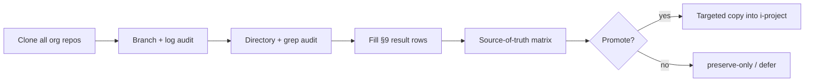

# GitHub organization repo recovery audit plan

**Organization:** [iappmodel](https://github.com/iappmodel)  
**Primary local archive (already present):** `~/Desktop/i-project-rescue/i_project_migration_archive`  
**Planned clone root (do not clone until explicitly approved):** `~/Desktop/i-project-rescue/github-source-repos/`  
**Audit date (plan authored):** 2026-05-20  
**Mode:** Plan and commands only — **no clones, merges, or promotions in this pass**

Related docs: [`BRANCH_AND_SOURCE_INTEGRATION_AUDIT.md`](BRANCH_AND_SOURCE_INTEGRATION_AUDIT.md), [`OLD_SOURCE_PRESERVATION_REPORT.md`](OLD_SOURCE_PRESERVATION_REPORT.md), [`FULL_REPO_SOURCE_RECOVERY_AUDIT.md`](FULL_REPO_SOURCE_RECOVERY_AUDIT.md)

---

## 1. Why this audit is necessary

The portable migration archive (`i-project` on GitHub) centralizes **rescued** slices of Flutter runtime, investor demos, and narrow integration paths. Prior audits ([`BRANCH_AND_SOURCE_INTEGRATION_AUDIT.md`](BRANCH_AND_SOURCE_INTEGRATION_AUDIT.md)) show integration is **partial**: IVAULT monorepo branches, sparkle product trees, stashes, dirty worktrees, and DEMOS:REPOS siblings were never exhaustively compared to GitHub remotes.

Without a **systematic org-wide pass**, we risk:

- Promoting the wrong branch as source-of-truth (duplicate `eye-earn-sparkle*` repos, fork hashes in names).
- Missing production systems (POPS, wallet, rewards, trust, Studio, evidence vault) that live only on unpromoted branches.
- Treating local folders (`~/Desktop/IVAULT`, `~/iTrack`, `~/eye_tracking_app`) as canonical when GitHub has newer or divergent history.
- Merging or overwriting [`integrations/eye-tracking/`](../../integrations/eye-tracking/) and [`integrations/old-source-preservation/`](../../integrations/old-source-preservation/) before remotes are mapped.

This plan defines **clone → inspect → record** only. Promotion into `i_project_migration_archive` happens only after a written source-of-truth decision per system.

---

## 2. Full repo list (iappmodel)

| # | GitHub repo | Default clone directory name |
|---|-------------|------------------------------|
| 1 | `i-project` | `i-project` |
| 2 | `eye_tracking_app` | `eye_tracking_app` |
| 3 | `i-initial-structures` | `i-initial-structures` |
| 4 | `up-next-queue` | `up-next-queue` |
| 5 | `eye-earn-sparkle-archive` | `eye-earn-sparkle-archive` |
| 6 | `eye-earn-sparkle-v2` | `eye-earn-sparkle-v2` |
| 7 | `eye-earn-sparkle` | `eye-earn-sparkle` |
| 8 | `eye-earn-sparkle-56c8e614l` | `eye-earn-sparkle-56c8e614l` |
| 9 | `eye-earn-sparkle-56c8e614` | `eye-earn-sparkle-56c8e614` |
| 10 | `iview` | `iview` |
| 11 | `i-the-app` | `i-the-app` |

**Note:** `i_project_migration_archive` locally tracks `https://github.com/iappmodel/i-project.git`. A fresh clone under `github-source-repos/i-project` is for **isolated audit** (compare to existing tree without touching working copy).

---

## 3. Likely role of each repo (by name + prior local evidence)

| Repo | Likely represents | Confidence |
|------|-------------------|------------|
| **i-project** | Canonical migration archive: rescued launcher, promoted Flutter runtime, investor-demo variants, masterbrain inventory, integration docs. | High — matches primary workspace remote. |
| **eye_tracking_app** | Large Flutter/web monorepo: eye tracking, Studio routing, i Command, evidence vault, investor-demo branches; multiple local clones (`iTrack`, IVAULT) pointed here. | High — see branch audit §3.3. |
| **i-initial-structures** | Early MVP scaffold and home `~/eye_tracking_app` history (`investor-demo-mvp-night-build`, clean prototype imports). | High — see [`EYE_TRACKING_INTEGRATION_MAP.md`](EYE_TRACKING_INTEGRATION_MAP.md). |
| **up-next-queue** | Queue / scheduling UX or backend for “what’s next” in feed or earning flows (name-only until clone). | Low |
| **eye-earn-sparkle-archive** | Archived full product snapshot; local branch `codex/investor-demo-mode-v2` referenced in branch audit. | Medium |
| **eye-earn-sparkle-v2** | Second-generation earn/sparkle web or PWA app (rewards, attention, Mediapipe plugin paths). | Medium |
| **eye-earn-sparkle** | Primary earn/sparkle line; local copies on `demo-investor` / `main`. | Medium |
| **eye-earn-sparkle-56c8e614** | Point-in-time or Codex fork keyed by commit/hash `56c8e614` (duplicate-lineage candidate). | Low |
| **eye-earn-sparkle-56c8e614l** | Variant of above (trailing `l` — possible typo duplicate or Lovable export); treat as sibling until diff proves otherwise. | Low |
| **iview** | iView client (permissions/camera/mic/location mentioned in sparkle demo plugin example). | Low |
| **i-the-app** | Umbrella “the app” shell or monorepo entry (iOS/Android/web wrapper). | Low |

Reconcile every **High/Medium** repo against [`integrations/old-source-preservation/`](../../integrations/old-source-preservation/) before any promotion.

---

## 4. Priority order for inspection

Inspect in this order so downstream repos are interpreted against an already-mapped canonical archive.

| Priority | Repo | Rationale |
|----------|------|-----------|
| **P0** | `i-project` | Declared source-of-truth target; baseline for “what is already integrated.” |
| **P1** | `eye_tracking_app` | Largest missing slice (Studio, evidence vault, stashes analogs); same remote as iTrack/IVAULT. |
| **P2** | `i-initial-structures` | Unpromoted home commit `9e7cc37` vs archive import `4953e01`. |
| **P3** | `eye-earn-sparkle-archive` | Explicit archive product; branch audit flagged as not integrated. |
| **P4** | `eye-earn-sparkle` | Active earn/PWA line; multiple local checkouts. |
| **P5** | `eye-earn-sparkle-v2` | Successor stack; may supersede P4. |
| **P6** | `eye-earn-sparkle-56c8e614` | Dedup against P4–P5 before trusting content. |
| **P7** | `eye-earn-sparkle-56c8e614l` | Same as P6; likely redundant fork. |
| **P8** | `i-the-app` | Possible top-level app composition. |
| **P9** | `iview` | Viewer / permissions surface; may depend on P4–P5. |
| **P10** | `up-next-queue` | Peripheral until core earn/tracking sources are mapped. |

Within each repo: audit **`main` first**, then branches named in [`BRANCH_AND_SOURCE_INTEGRATION_AUDIT.md`](BRANCH_AND_SOURCE_INTEGRATION_AUDIT.md) (`integration/studio-routing-audit`, `investor-demo-mvp-night-build`, `codex/investor-demo-mode-v2`, `demo-investor`, etc.), then all other `origin/*` heads from `git branch -a`.

---

## 5. Clone destination recommendation

Use a **dedicated sibling directory** so audit clones never overwrite the live archive or scattered Desktop clones:

```text
~/Desktop/i-project-rescue/github-source-repos/
├── i-project/
├── eye_tracking_app/
├── i-initial-structures/
├── up-next-queue/
├── eye-earn-sparkle-archive/
├── eye-earn-sparkle-v2/
├── eye-earn-sparkle/
├── eye-earn-sparkle-56c8e614l/
├── eye-earn-sparkle-56c8e614/
├── iview/
└── i-the-app/
```

**Rules:**

- One folder per repo; directory name = repo name.
- Do not `git pull` into `i_project_migration_archive` as a substitute for this tree.
- Keep clones read-only for audit (no merges into archive until §10 gates pass).

---

## 6. Safe clone commands (every repo)

Run only when explicitly approved to clone. Creates destination once; uses HTTPS; full history (no `--depth 1`) so `git log --all` is meaningful.

```bash
mkdir -p ~/Desktop/i-project-rescue/github-source-repos
cd ~/Desktop/i-project-rescue/github-source-repos

git clone https://github.com/iappmodel/i-project.git i-project
git clone https://github.com/iappmodel/eye_tracking_app.git eye_tracking_app
git clone https://github.com/iappmodel/i-initial-structures.git i-initial-structures
git clone https://github.com/iappmodel/up-next-queue.git up-next-queue
git clone https://github.com/iappmodel/eye-earn-sparkle-archive.git eye-earn-sparkle-archive
git clone https://github.com/iappmodel/eye-earn-sparkle-v2.git eye-earn-sparkle-v2
git clone https://github.com/iappmodel/eye-earn-sparkle.git eye-earn-sparkle
git clone https://github.com/iappmodel/eye-earn-sparkle-56c8e614l.git eye-earn-sparkle-56c8e614l
git clone https://github.com/iappmodel/eye-earn-sparkle-56c8e614.git eye-earn-sparkle-56c8e614
git clone https://github.com/iappmodel/iview.git iview
git clone https://github.com/iappmodel/i-the-app.git i-the-app
```

**Safety notes:**

- If a directory already exists, **do not** re-clone over it; `cd` into it and `git fetch --all --prune` instead.
- If authentication fails, use `gh auth login` or SSH remotes (`git@github.com:iappmodel/<repo>.git`) — do not embed tokens in shell history.
- Private repos: ensure org access before batch clone.

---

## 7. Audit commands (run inside each cloned repo)

For each repo, from its root (`cd ~/Desktop/i-project-rescue/github-source-repos/<repo>`):

### 7.1 Git topology

```bash
git branch -a
git log --oneline --decorate --graph --all --max-count=120
```

### 7.2 Directory shape (depth-limited)

```bash
find . -maxdepth 4 -type d \
  ! -path './.git/*' \
  ! -path '*/node_modules/*' \
  ! -path '*/.dart_tool/*' \
  ! -path '*/build/*' \
  ! -path '*/dist/*' \
  | sort
```

### 7.3 System keyword sweep

Run from repo root (adjust if ripgrep unavailable: use `grep -RIn`):

```bash
SYSTEMS=(
  POPS wallet rewards trust fraud campaigns currency ELO
  ivatar "remote control" studio "evidence vault" feed
  "earning loops" payments admin "database migrations"
)

for term in "${SYSTEMS[@]}"; do
  echo "======== $term ========"
  rg -n --hidden -g '!.git' -g '!node_modules' -g '!dist' -g '!build' -g '!.dart_tool' \
    -i "$term" . 2>/dev/null | head -80
done
```

Save full ripgrep output per repo to:

```text
~/Desktop/i-project-rescue/github-source-repos/_audit-logs/<repo>-system-grep.txt
```

Create log dir once: `mkdir -p ~/Desktop/i-project-rescue/github-source-repos/_audit-logs`

### 7.4 Optional dedup helpers (sparkle family only)

After P4–P7 clones exist:

```bash
for d in eye-earn-sparkle eye-earn-sparkle-v2 eye-earn-sparkle-archive \
         eye-earn-sparkle-56c8e614 eye-earn-sparkle-56c8e614l; do
  echo "=== $d ==="
  (cd ~/Desktop/i-project-rescue/github-source-repos/$d && git rev-parse HEAD && git remote -v)
done
```

---

## 8. Systems to search (checklist)

Map hits to the output schema in §9. Search terms (case-insensitive):

| System | Search hints (add variants as needed) |
|--------|--------------------------------------|
| POPS | `POPS`, `pops`, proof-of-presence |
| wallet | `wallet`, `Wallet` |
| rewards | `reward`, `rewards` |
| trust | `trust`, `trustScore` |
| fraud | `fraud`, `anti-fraud` |
| campaigns | `campaign`, `campaigns` |
| currency | `currency`, `credits`, `coins` |
| ELO | `ELO`, `elo`, rating |
| ivatar | `ivatar`, `iAvatar`, avatar |
| remote control | `remote control`, `remoteControl`, `RemoteControl` |
| studio | `studio`, `Studio` |
| evidence vault | `evidence vault`, `evidenceVault`, `EvidenceVault` |
| feed | `feed`, `Feed` |
| earning loops | `earning`, `earn loop`, `eye-earn` |
| payments | `payment`, `stripe`, `billing` |
| admin | `admin`, `AdminPanel` |
| database migrations | `migration`, `migrations`, `schema.sql`, `prisma`, `flyway`, `alembic` |

---

## 9. Output format for later audit (per finding)

Record one row per **actionable hit** (file or directory cluster). Suggested file for aggregate results:

`docs/technical/GITHUB_REPO_RECOVERY_AUDIT_RESULTS.md` (created in a **future** pass after clones complete).

| Field | Description |
|-------|-------------|
| **repo** | GitHub repo name (e.g. `eye_tracking_app`) |
| **branch** | Branch or tag where the hit was found (e.g. `integration/studio-routing-audit`) |
| **system** | One of §8 systems |
| **source path** | Repo-relative path (e.g. `lib/studio/router.dart`) |
| **status** | `present` \| `partial` \| `missing` \| `duplicate` \| `unknown` |
| **promotion recommendation** | `promote` \| `preserve-only` \| `defer` \| `reject` \| `merge-blocked` |

**Example row (illustrative):**

| repo | branch | system | source path | status | promotion recommendation |
|------|--------|--------|-------------|--------|----------------------------|
| eye_tracking_app | integration/studio-routing-audit | studio | apps/studio/ | present | defer — compare to `integrations/old-source-preservation/ivault-eye-tracking/` |

Do not populate promotion as `promote` until source-of-truth matrix is signed off.

---

## 10. Warnings (mandatory)

1. **Do not merge anything yet** — no merges from `github-source-repos/*` into `i_project_migration_archive`, IVAULT folders, or `~/eye_tracking_app`.
2. **Clone and inspect first** — branch topology and grep logs precede any file copy.
3. **Promote only after source-of-truth decision** — per repo × branch × system, documented in `GITHUB_REPO_RECOVERY_AUDIT_RESULTS.md` (future) and cross-checked with [`FULL_REPO_SOURCE_RECOVERY_AUDIT.md`](FULL_REPO_SOURCE_RECOVERY_AUDIT.md).
4. **Do not delete** local Desktop clones or stashes until GitHub audit rows exist for the same content.
5. **Preserve** [`integrations/old-source-preservation/`](../../integrations/old-source-preservation/) and [`source-runtime-candidates/`](../../integrations/eye-tracking/source-runtime-candidates/) as immutable evidence during comparison.

---

## 11. Suggested workflow after clone approval



---

## 12. Deliverables checklist (future execution)

- [ ] All 11 repos cloned under `github-source-repos/`
- [ ] `_audit-logs/*` grep artifacts per repo
- [ ] `GITHUB_REPO_RECOVERY_AUDIT_RESULTS.md` populated
- [ ] `FULL_REPO_SOURCE_RECOVERY_AUDIT.md` updated from placeholder to final matrix
- [ ] Source-of-truth decision recorded per §8 system

---

*End of plan — clones not executed in this document pass.*
