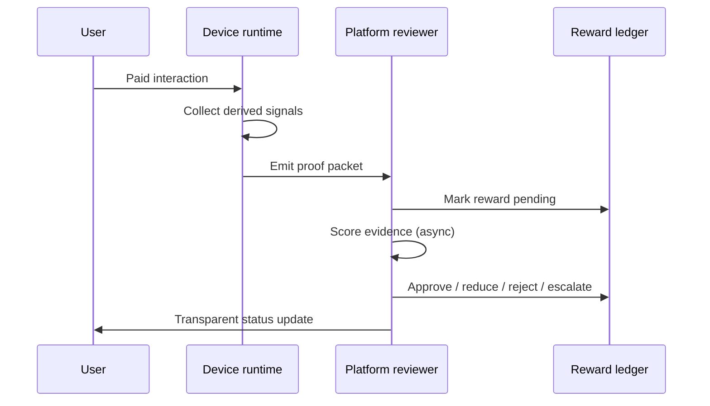

# POPS multi-signal validation architecture

**Date:** 2026-05-20  
**Status:** Architecture / product decision — docs only  
**Runtime (signal source, not sole validator):** [`integrations/eye-tracking/flutter-runtime/`](../../integrations/eye-tracking/flutter-runtime/)  
**Related:** [`VERIFICATION_STABILITY_LAYER_V1.md`](VERIFICATION_STABILITY_LAYER_V1.md), [`Y_PLANE_TRANSPORT_EXPERIMENT.md`](Y_PLANE_TRANSPORT_EXPERIMENT.md), [`MVP_CANONICAL_FLOW.md`](../MVP_CANONICAL_FLOW.md)

---

## 1. Core principle

**Truth should not come from one measurement.**

The Android eye-tracking runtime is a working **signal producer**, not the entire [ i ] validation system. Gaze, dwell, blink, and face presence strengthen proof; they do not define payout truth alone.

**Validation does not need to be instant.** After a paid interaction, the platform may review evidence afterward—seconds to hours—before settling rewards. This supports:

| Need | Why delayed review helps |
|------|---------------------------|
| Remote control | Operators and backends can audit without real-time payout pressure |
| Fraud resistance | Multiple signals can be correlated after the session |
| Flexible eye-tracking timing | Frame drops and pipeline lag do not force false rejection |
| Multi-signal fusion | Disagreement across signals is visible only after aggregation |
| Post-interaction settlement | Rewards enter **pending** until review completes |

**Default privacy posture:** Sessions are recorded as **derived signals** (zones, dwell intervals, confidence scores, events)—not raw video storage unless explicitly opted in for dispute resolution.

---

## 2. POPS layers

POPS is the umbrella for **Proof of …** evidence that together justify that a human actually participated in a monetized interaction.

| Layer | Question answered | Typical signals |
|-------|-------------------|-----------------|
| **Proof of Presence** | Was a plausible human present during the interaction window? | Face presence, session duration, foreground state, liveness/blink |
| **Proof of Participation** | Did the user perform required interaction (watch, tap, scroll, complete)? | Touch/tap, scroll, content completion, playback state, timing |
| **Proof of Perception** | Did attention align with the content/task (not just “camera on”)? | Gaze zone / dwell, attention windows, challenge-response |
| **Proof of Signal** | Are device and session signals internally consistent? | Motion, network/session consistency, app state, anomaly flags |
| **Proof of Session Integrity** | Was the session continuous and un-tampered end-to-end? | Session IDs, packet sequence, clock skew bounds, backgrounding |
| **Proof of Reward Eligibility** | Does this session qualify under campaign rules and policy? | Completion state, offer rules, fraud graph, prior farming patterns |

Layers are **scored independently** and combined into a validation outcome. No single layer is sufficient for high-value settlement without corroboration.

---

## 3. Signals that can contribute

Signals are categorized by what they support. A given interaction may only emit a subset; the review engine weights what is present.

| Signal | Primary POPS layers | Notes |
|--------|---------------------|-------|
| Eye gaze / dwell | Perception, Presence | Windowed, not per-frame instant truth |
| Blink response | Presence, Perception | Liveness and attention coupling |
| Face presence | Presence | Coarse; pairs with gaze for mismatch detection |
| Session duration | Participation, Presence | Must align with content length rules |
| Touch / tap events | Participation | Required for interactive offers |
| Scroll behavior | Participation, Perception | Feed vs static content |
| Audio/video playback state | Participation | Completion vs “timer only” |
| Device motion | Signal, Integrity | Impossible stillness vs violent spoof |
| Interaction timing | Participation, Signal | Human-plausible cadence |
| App foreground state | Integrity, Presence | Backgrounding weakens proof |
| Network / session consistency | Signal, Integrity | Device/session binding |
| Challenge-response events | Perception, Presence | Periodic humane checks |
| Content completion state | Participation, Eligibility | Gate before full approval |
| Anomaly / fraud flags | Signal, Eligibility | Farming, bots, emulator hints |

Eye-tracking from the Flutter runtime feeds **Perception** and **Presence**; platform and app instrumentation feed the rest.

---

## 4. Delayed validation model

| Stage | Responsibility |
|-------|----------------|
| **Capture** | Local runtime aggregates frames/events into summaries (dwell windows, blink events, stability confidence, completion) |
| **Packetize** | Runtime exports a **proof packet** (JSON or signed blob) — no raw video by default |
| **Transmit** | Packet queued to backend or held for local/offline review |
| **Review** | Validation engine scores layers; human admin optional in MVP |
| **Settle** | Ledger moves reward from pending to final state |

**Remote control:** A remote session (e.g. TV, second screen, cast) still produces a proof packet on the interaction device; validation is delayed, so operators can challenge suspicious remote patterns without blocking the UX on every frame.

---

## 5. Validation lifecycle

1. **User starts paid interaction** — offer rules loaded (duration, gates, optional challenges).
2. **Device collects signals** — eye-tracking, touch, playback, foreground, etc., as available.
3. **Runtime emits proof packet** — end of session or periodic chunks + final seal.
4. **Platform marks reward as pending** — user may see “earned, validating…” not instant cash-out truth.
5. **Review / validation engine scores evidence** — per-layer scores + composite decision.
6. **Outcome** — **approved**, **partially approved** (reduced amount), **rejected**, or **escalated** (manual review).
7. **User sees transparent status** — timeline: captured → pending → result + reason category (not leaky internals).

Instant UI feedback (attention ring, progress bar) is **indicative**; **authoritative** payout follows lifecycle step 5–6.

---

## 6. Eye-tracking timing flexibility

Eye-tracking must not be judged as instant frame-truth.

| Practice | Rationale |
|----------|-----------|
| **Validation windows** | e.g. 2–10 s rolling windows; score dwell in zone, not single frame |
| **Delayed processing** | Backend may re-run smoothing; matches [`VERIFICATION_STABILITY_LAYER_V1.md`](VERIFICATION_STABILITY_LAYER_V1.md) |
| **Tolerate frame drops** | Low `processedFps` reduces confidence; does not auto-fail if other signals agree |
| **Confidence accumulation** | Band moves POOR → USABLE → STRONG over time; payout uses integral evidence |
| **Interval proof** | “Attention occurred during valid interval” vs “eyes on pixel 437 at t=12.003” |

Pipeline optimizations (e.g. Y-plane transport) improve **signal quality and cost**, not the requirement for instantaneous validation.

---

## 7. Remote control implications

| Topic | Design |
|-------|--------|
| Payout timing | No real-time payout required; remote sessions use same pending → review → settle path |
| Audit | Proof packets retained for replay of **derived** evidence |
| Challenge | Suspicious remote patterns → delayed payout + optional challenge-response on next session |
| Device binding | Signal layer checks that interaction device matches session/device fingerprint expectations |

---

## 8. Reward states

| State | Meaning | User-facing copy (example) |
|-------|---------|----------------------------|
| **earned locally** | Client computed provisional credit from session rules | “+2.00 iCoins — confirming…” |
| **pending validation** | Proof packet received; review in progress | “Validating your watch” |
| **approved** | Full eligibility confirmed | “Reward confirmed” |
| **partially approved** | Some layers weak; reduced payout | “Reward adjusted — partial attention proof” |
| **rejected** | Failed policy or fraud thresholds | “Not eligible — session did not meet requirements” |
| **under review** | Escalated to human or extended automated checks | “Under review — we’ll notify you” |

Wallet UI should separate **available**, **pending validation**, and **lifetime earned** ([`MVP_CANONICAL_FLOW.md`](../MVP_CANONICAL_FLOW.md) Step 6 already implies pending balance).

---

## 9. Fraud and abuse resistance

The engine treats **disagreement** and **impossibility** as first-class inputs.

| Pattern | Detection approach |
|---------|-------------------|
| Multi-signal disagreement | High gaze score + no playback progress + backgrounded app |
| Repeated identical behavior | Farming: same timing signature across sessions |
| Impossible timing | Completion faster than content duration; zero interaction latency variance |
| Face / gaze mismatch | Face present, gaze never in content zone for required window |
| App backgrounding | Foreground loss during earn window |
| Remote / device mismatch | Session IP/device graph vs claimed interaction device |
| Low-confidence proof packet | Stability band POOR for majority of window; sparse valid frames |
| Suspicious reward farming | Velocity limits, advertiser-level audit trail (later) |

Rejected sessions should store **reason codes** (layer + rule id), not raw camera artifacts.

---

## 10. MVP version

Minimum viable POPS path for the promoted Android runtime + demo spine:

| Component | MVP scope |
|-----------|-----------|
| Proof packet | Simple JSON: `sessionId`, `offerId`, `startedAt`, `endedAt`, dwell summaries, blink events, stability snapshot, `contentCompleted` |
| Signals | Local eye-tracking (zone, dwell), blink, content completion flag |
| Validation | Client shows provisional earn; server or **manual/admin review** accepts packet → approve/reject |
| UX | Reward **pending validation** screen; wallet pending tab |
| Copy | “We validate attention after your session” — sets expectation vs instant camera payout |
| Non-goals | Full automated scoring engine, cryptographic attestation, fraud graph |

Wire [`verification_stability_layer.dart`](../../integrations/eye-tracking/flutter-runtime/lib/verification/verification_stability_layer.dart) output into the packet as **proof confidence**, not instant ledger truth.

---

## 11. Later version

| Capability | Benefit |
|------------|---------|
| Automated scoring engine | Layer weights per campaign type; SLA for pending → approved |
| Adaptive user baseline | Personal gaze/dwell norms; reduces false reject for disability/lighting |
| Cryptographic proof packet | Tamper-evident submission; replay defense |
| Privacy-preserving device attestation | Stronger Signal + Integrity without storing biometrics server-side |
| Fraud graph | Cross-user/device/advertiser clustering |
| Advertiser-level audit trail | Dispute resolution and CPM reconciliation |

---

## 12. Impact on Android runtime roadmap

| Stop | Start / continue |
|------|------------------|
| Treating eye-tracking as the **only** validator | Eye-tracking as a **strong Perception + Presence signal** |
| Blocking payout on single-frame or single-gate failure | Export **proof packets**; decouple HUD from settlement |
| Real-time reward settlement tied to gaze callbacks | **Pending validation** model + separate settlement service |
| — | Optimize pipeline (Y-plane, stability layer) for **signal quality** |
| — | **Evidence review** screen (operator or user status) |
| — | Keep reward settlement **async** relative to camera loop |

Concrete next engineering items (ordered):

1. Define proof packet schema v0 and emit on session end from Flutter runtime.
2. Add `pending_validation` to demo wallet + reward reveal copy.
3. Plumb stability layer snapshot into packet.
4. Stub review API (accept packet → return approved/rejected/partial).

---

## 13. Investor explanation

**[ i ] is not “pay people if the camera sees eyes.”**

[ i ] is a **delayed proof-of-interaction economy**:

- Users engage with sponsored or verified content.
- Devices emit a **bundle of behavioral, device, and session signals** (POPS).
- The platform **reviews proof after the interaction** and then settles rewards.
- Eye-tracking **strengthens** proof of perception and presence; it does not carry the system alone.

This framing supports fraud resistance, remote and second-screen scenarios, and honest engineering timelines: the runtime can ship strong signals before the full automated reviewer ships.

---

## References

| Doc | Role |
|-----|------|
| [`VERIFICATION_STABILITY_LAYER_V1.md`](VERIFICATION_STABILITY_LAYER_V1.md) | Local proof confidence bands |
| [`Y_PLANE_TRANSPORT_EXPERIMENT.md`](Y_PLANE_TRANSPORT_EXPERIMENT.md) | Signal throughput optimization |
| [`EYE_TRACKING_INTEGRATION_MAP.md`](EYE_TRACKING_INTEGRATION_MAP.md) | Runtime placement in [ i ] |
| [`MVP_CANONICAL_FLOW.md`](../MVP_CANONICAL_FLOW.md) | Watch → verify → earn demo spine |
| [`ANDROID_EYE_TRACKING_SMOKE_TEST_RESULT.md`](ANDROID_EYE_TRACKING_SMOKE_TEST_RESULT.md) | On-device signal baseline |
