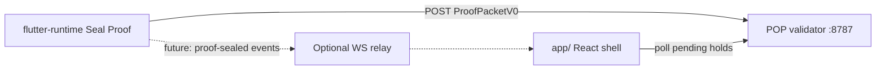

# React ↔ Flutter proof bridge (Phase 2 design)

**Status:** Design + env hooks — implementation deferred to Phase 3  
**Goal:** Real gaze from `flutter-runtime` into `app/` watch-verify without duplicating POP logic.

---

## Recommended architecture

**Phase 2 decision:** Keep React mock packet for Loop 1 presenter fidelity. Flutter posts real packets independently to the same validator.

---

## Env hooks (future)

| Surface | Variable |
|---------|----------|
| Flutter | `POP_VALIDATOR_URL` (dart-define) |
| React | `VITE_POP_VALIDATOR_URL` |
| Optional relay | `VITE_PROOF_WS_URL` (not implemented) |

---

## Phase 3 implementation options

1. **Capacitor shell** — embed Flutter module in WebView (heaviest)
2. **WebSocket relay** — validator broadcasts `ProofPacketSealedEvent` to subscribed tabs
3. **Shared session id** — deep link `iapp://proof?session=…` from Flutter back to app wallet tab

See `docs/technical/ANDROID_SEAL_PROOF_RUNBOOK.md` for device path today.
