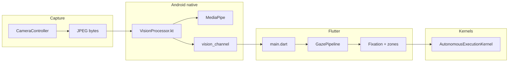

# Eye tracking app — map of content

> [!abstract] Use this note as the **dashboard**. Deep dives live in linked atomic notes.

## One-sentence pitch

**Flutter** front camera app: **[[native-android-vision]]** produces gaze and quality signals; **[[gaze-dart-pipeline]]** smooths and gates them; **[[intent-os-overview]]** plus four **kernels** decide when UI side effects run.

## Stack (summary)

| Layer | Note / code |
|--------|----------------|
| Capture + bridge | [[native-android-vision]] |
| Dart gaze | [[gaze-dart-pipeline]] |
| Intent stages + bus | [[intent-os-overview]] |
| Safety chain | [[kernel-autonomous-execution]] → links to each kernel |

Repo appendix for numbers & platform facts: **`AGENTS.md`** (link or embed in vault as you prefer).

## End-to-end flow



## Atomic notes — index

| Topic | Link |
|--------|------|
| Native / MediaPipe / channel | [[native-android-vision]] |
| Gaze smoothing, zones, fixation | [[gaze-dart-pipeline]] |
| Intent OS stages + `IntentOS` | [[intent-os-overview]] |
| `ActionPipelineKernel` | [[kernel-action-pipeline]] |
| `GovernanceKernel` | [[kernel-governance]] |
| `SafetyKernel` | [[kernel-safety]] |
| Gate orchestration | [[kernel-autonomous-execution]] |

## Tests as spec

- Kernels: `test/safety_kernel_test.dart`, `test/governance_kernel_test.dart`, `test/autonomous_execution_kernel_test.dart`, `test/bypass_paths_test.dart`
- Gaze / behavior: `test/gaze_normalize_test.dart`, `test/blink_detector_test.dart`, …

## Open questions (seed) — **resolved in repo**

The six items below are **closed as design decisions** with rationale and implementation backlog in the repository file **`docs/DECISIONS.md`** (2026-04-23). Treat that file as the canonical decision log; vault notes may link or mirror with tag `#eye-tracking/decision`.

1. ~~Autonomous actions: default allow vs confirm by [[kernel-safety]] tier?~~ → **Tiered confirm-first; optional Autopilot for low-risk reversible actions** (`docs/DECISIONS.md` §Q1).
2. ~~User-visible confidence — subtle vs explicit?~~ → **Hybrid subtle + explicit on block/near-threshold** (§Q2).
3. ~~iOS parity path?~~ → **Android-first v1; iOS honest “no gaze” until spike** (§Q3).
4. ~~A11y: voice vs dwell interaction.~~ → **Dwell-first + platform a11y mandatory; voice commands backlog** (§Q4).
5. ~~Battery: camera preset vs quality (`AGENTS.md`).~~ → **Default medium preset; optional high + measurement** (§Q5).
6. ~~Telemetry boundaries.~~ → **Local-first audit; opt-in export/cloud** (§Q6).

## Brainstorm stubs

- [[gaze latency budget]]
- [[calibration vs fixed bounds]]
- [[intent UX for false positives]]
- [[audit log productization]]

## Copy into vault checklist

- [ ] Copy `Projects/eye-tracking-app/` under your vault’s `Projects/` (or symlink).
- [ ] Optional: mirror `AGENTS.md` into a note `AGENTS-eye-tracking` for Dataview.
- [ ] Tag decisions `#eye-tracking/decision`.

## Code entrypoints

```
lib/main.dart
lib/engine/gaze_pipeline.dart
lib/core/intent_os/
```

---

*MOC for repo `eye_tracking_app`.*
