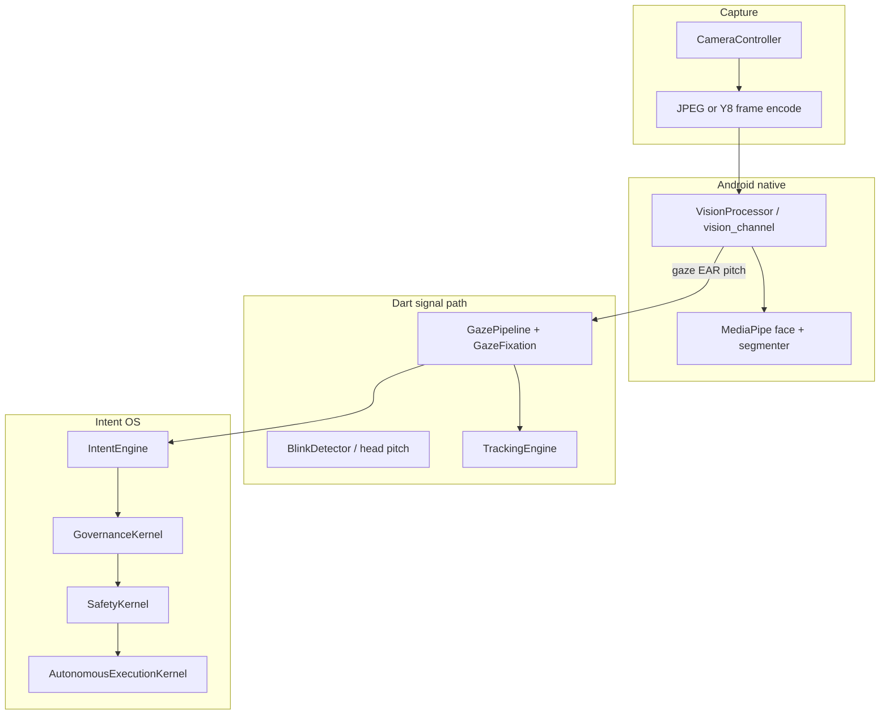

# eye_tracking_app

Flutter front camera pipeline with Android **MediaPipe** face/iris gaze, blink (EAR), head pose, and a Dart **intent OS** (governance, safety, autonomous execution). The live app is wired through [`lib/main.dart`](lib/main.dart); agent and safety conventions live in **[`AGENTS.md`](AGENTS.md)** (read that before changing behavior).

## Quick start

```bash
flutter pub get
flutter analyze
flutter test
```

Run on a device or emulator:

```bash
flutter run
```

Android is the primary vision target (native `MethodChannel('vision_channel')`). iOS/macOS can run the Flutter shell; camera image stream usage follows plugin/platform constraints (see `AGENTS.md`).

## Platform matrix

| Platform | Camera | Native gaze / landmarks | Notes |
|----------|--------|-------------------------|--------|
| **Android** | Yes | Yes — `VisionProcessor.kt`, MediaPipe Tasks (`face_landmarker.task`, `selfie_segmenter.tflite`) | `CAMERA` in manifest; runtime permission in Dart |
| **iOS** | Yes | Dart-side ML Kit / bridge as configured in app | `NSCameraUsageDescription` in [`ios/Runner/Info.plist`](ios/Runner/Info.plist) |
| **macOS** | Yes | Same as iOS path for Flutter camera | `NSCameraUsageDescription` in [`macos/Runner/Info.plist`](macos/Runner/Info.plist); useful for UI work without a phone |

## Architecture (high level)



- **Perception → gaze**: Native results feed normalization ([`lib/gaze_normalize.dart`](lib/gaze_normalize.dart)), zones ([`lib/gaze_zone.dart`](lib/gaze_zone.dart)), and [`lib/engine/gaze_pipeline.dart`](lib/engine/gaze_pipeline.dart) with fixation in [`lib/gaze_fixation.dart`](lib/gaze_fixation.dart).
- **Intent / safety**: [`lib/core/intent_os/`](lib/core/intent_os/) — kernels gate autonomous UI actions; see tests under [`test/`](test/).
- **Legacy sketch**: Top-level [`core/`](core/README.md) is **not** used by the app entrypoint; prefer `lib/` (see [`core/README.md`](core/README.md) and [`docs/legacy_core.md`](docs/legacy_core.md)).

## Repo layout (essentials)

| Path | Role |
|------|------|
| [`lib/main.dart`](lib/main.dart) | App entry, camera lifecycle, vision bridge, intent loop, much of the UI |
| [`lib/core/intent_os/`](lib/core/intent_os/) | Governance, safety, execution, intent types |
| [`lib/core/stability/`](lib/core/stability/) | `TrackingEngine` / `TrackingState` |
| [`android/app/src/main/.../VisionProcessor.kt`](android/app/src/main/java/com/example/eye_tracking_app/) | Native vision (authoritative sync with `~/Desktop/iTrack` per `AGENTS.md`) |
| [`test/`](test/) | Unit tests — run `flutter test` |

Mechanical refactor plan for splitting `main.dart`: [`docs/main_dart_refactor_plan.md`](docs/main_dart_refactor_plan.md).

## Concept model (economy)

### Wallet

A user has exactly one wallet.

```text
wallet
  user_id
  status
```

The wallet does not hold the truth. It owns value lots and ledger entries.

### Value lot

A value lot is one chunk of earned or credited value.

Example:

- User earns 100 ICOIN from Campaign A.
- Create one value lot for 100 ICOIN.

Each lot stores:

- Source
- Original amount
- Remaining amount
- Currency
- State
- Pending release time
- Trust/fraud snapshot

Why lots matter:

- Claw back only suspicious reward slices.
- Expire specific promotional value.
- Lock specific funds for withdrawal.
- Trace every coin to its campaign origin.

### Value lot states

- `pending`  
  Reward exists but is not usable yet.

  Example:
  - User earned 100 ICOIN.
  - Trust score is low.
  - Hold for 72 hours.

- `available`  
  User can spend, convert, or withdraw.

- `locked`  
  Value is reserved for an outgoing action.

  Example:
  - User requests withdrawal.
  - Funds move from `available` -> `locked`.

- `spent`  
  Value was consumed inside the platform.

- `clawed_back`  
  Value was removed because of fraud, dispute, or policy reversal.

- `expired`  
  Promotional value expired.

### Ledger entry

The ledger is the immutable journal.

Example entries:

- `credit_pending 100 ICOIN`
- `unlock 100 ICOIN`
- `debit_withdrawal 100 ICOIN`

Never edit or delete ledger entries. Add corrections as new entries.

### Balance projection

Balance projection is a fast cached view.

Example:

- `pending: 250 ICOIN`
- `available: 900 ICOIN`
- `locked: 100 ICOIN`
- `withdrawn: 500 ICOIN`
- `spent: 200 ICOIN`

Projection exists for speed only. If corrupted, rebuild from the ledger.

## CI

GitHub Actions runs `flutter analyze` and `flutter test` on push and pull requests (see [`.github/workflows/flutter.yml`](.github/workflows/flutter.yml)).

## Contributing and autonomy

- **[`AGENTS.md`](AGENTS.md)** — learned preferences, vision contracts, and **autonomous agent approval gates** (when a human must sign off).
- **[`CONTRIBUTING.md`](CONTRIBUTING.md)** — short flow for contributors and coding agents.
- **[`FINAL_ARCHITECTURE_INDEX.md`](FINAL_ARCHITECTURE_INDEX.md)** — master backend system map (attention → reward → wallet → accounting → trust → payout → audit/observability), ownership boundaries, non-bypass invariants, implementation checklist, and unresolved production risks.
- **[`IMPLEMENTATION_CHECKLIST.md`](IMPLEMENTATION_CHECKLIST.md)** — Step 6.19 execution bridge: phased build order, hard fail gates, SQL/API/RLS smoke tests, reconciliation invariants, and production readiness criteria.
- **[`docs/iearn_master_build_spec.md`](docs/iearn_master_build_spec.md)** — canonical Iearn product philosophy, UX, marketplace/economy model, reward/scoring logic, schema draft, and MVP build order.

## Developer notifications (macOS)

To get **Cursor** desktop alerts when the assistant finishes, use **System Settings → Notifications → Cursor** (banners/sounds). That is an OS/app setting, not something this repo configures.

Optional: after local commands, run [`scripts/notify_macos.sh`](scripts/notify_macos.sh) to post a Notification Center message (see script header).
